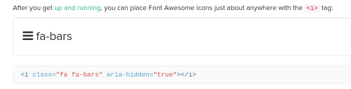

#

This lesson was based on the page **[Video and audio content](https://developer.mozilla.org/en-US/docs/Learn/HTML/Multimedia_and_embedding/Video_and_audio_content)** by MDN web docs,  **[Lesson 9: Adding Media](https://learn.shayhowe.com/html-css/adding-media/#adding-video)** by Shay Howe and [**Multimedia and Embedding**](https://developer.mozilla.org/en-US/docs/Learn/HTML/Multimedia_and_embedding) by MDN web docs.


# HTML5 & Multimedia

The [HTML5](https://developer.mozilla.org/en-US/docs/Glossary/HTML5) specification includes native support for `<video>` and `<audio>` elements as well as new [JavaScript](https://developer.mozilla.org/en-US/docs/Glossary/JavaScript) [APIs](https://developer.mozilla.org/en-US/docs/Glossary/API) for controlling them. For now we will only focus on the HTML functionality.


# Audio Element

Use the  `<audio>` element to quickly add audio tracks to your page. Similarly to the `` tag, it requires a `src=` attribute that points to the audio file.

<br>

```html
<audio src="./wk10/assets/bensound-summer.mp3" controls></audio>

<audio src="https://www.bensound.com/bensound-music/bensound-summer.mp3" controls></audio>
```

<h4>Local relative path</h4>
<audio src="./wk10/assets/bensound-summer.mp3" controls></audio>
<h4>Absolute URL path</h4>
<audio src="https://www.bensound.com/bensound-music/bensound-summer.mp3" controls></audio>
<br>

<br>

Notice the following:

-  The use of a **relative OR absolute path** (in case the file is hosted on another computer).


- The use of the  `controls` attribute.  Without `controls` the audio file would be part of the page but could not be accessed by the used (it could still be accessed via JavaScript however).


<br>

There are other attributes that can be assigned to the `<audio>` element:


| Attribute                                                    | Value                | Description                                                  |
| ------------------------------------------------------------ | -------------------- | ------------------------------------------------------------ |
| [autoplay](https://www.w3schools.com/tags/att_audio_autoplay.asp) | autoplay             | Specifies that the audio will start playing as soon as it is ready |
| [controls](https://www.w3schools.com/tags/att_audio_controls.asp) | controls             | Specifies that audio controls should be displayed (such as a play/pause button etc) |
| [loop](https://www.w3schools.com/tags/att_audio_loop.asp)    | loop                 | Specifies that the audio will start over again, every time it is finished |
| [muted](https://www.w3schools.com/tags/att_audio_muted.asp)  | muted                | Specifies that the audio output should be muted              |
| [preload](https://www.w3schools.com/tags/att_audio_preload.asp) | auto  metadata  none | Specifies if and how the author thinks the audio should be loaded when the page loads. Auto is the default. |
| [src](https://www.w3schools.com/tags/att_audio_src.asp)      | *URL*                | Specifies the URL of the audio file                          |


<br>

With the exception of `preload` and `src`, all other attributes are ***Boolean* attributes, meaning they don't require a value**.

<br>

To make sure someone will never comeback to your page, [add an audio track without controls, in autoplay, and looping](https://codepen.io/maujac/pen/vYNLpxx?editors=1000) (some browsers might block autoplay).


<br>

## Supported audio formats

Currently, there are 3 widely supported file formats for the `<audio>` element:

| Format | [MIME-type](https://developer.mozilla.org/en-US/docs/Glossary/MIME_type) |
| ------ | ------------------------------------------------------------ |
| MP3    | audio/mpeg                                                   |
| OGG    | audio/ogg                                                    |
| WAV    | audio/wav                                                    |


<br>

## Audio Fallbacks & Sources

It is possible **and recommended** to supply more than one audio format for any given audio track. This works as a fallback sequence or files and guarantees browser support.

<br>

To do this, move the `src` attribute inside a `<souce>` element:

<br>

```html
<audio controls>
  <source src="jazz.ogg" type="audio/ogg">
  <source src="jazz.mp3" type="audio/mpeg">
  <source src="jazz.wav" type="audio/wav">
  <p> If you see this, your browser does not supports audio playback</p>
</audio>
```


<br>

Each `<source>` should be followed by a `type` attribute, which specifies the [MIME type](https://developer.mozilla.org/en-US/docs/Glossary/MIME_type) of the file.

<br>

A **[MIME type](https://developer.mozilla.org/en-US/docs/Glossary/MIME_type)** (called "media type" or "content type") is a string sent along with a file indicating the type of the file (content format).  By using the MIME type browsers can choose to immediately skip videos they don't understand.

<br>

Notes on the `<audio>` tag:

<br>

- By default it has `display: inline`;
- Some styling properties apply such as: `margin` , `border` and `border-radius`;
- You can resize it with `width` property.

<br>

<iframe height="293" style="width: 100%;" scrolling="no" title="wk10 - audio_styling - Ex2" src="https://codepen.io/maujac/embed/vYNLREw?height=293&theme-id=light&default-tab=html,result" frameborder="no" allowtransparency="true" allowfullscreen="true" loading="lazy">
  See the Pen <a href='https://codepen.io/maujac/pen/vYNLREw'>wk10 - audio_styling - Ex2</a> by Mauricio Buschinelli
  (<a href='https://codepen.io/maujac'>@maujac</a>) on <a href='https://codepen.io'>CodePen</a>.
</iframe>

<br>

# Video Element


Adding video is very similar to adding audio. Use the `<video>` tag and specify the target  `src` . 

<br>

```html
<video src="./wk10/assets/rabbit.webm" controls></video>
```

<video src="./wk10/assets/rabbit.webm" controls></video>


<br>

The `<video>` element supports the following attributes (in most browsers):


| Attribute                                                    | Value                | Description                                                  |
| ------------------------------------------------------------ | -------------------- | ------------------------------------------------------------ |
| [autoplay](https://www.w3schools.com/tags/att_video_autoplay.asp) | autoplay             | Specifies that the video will start playing as soon as it is ready |
| [controls](https://www.w3schools.com/tags/att_video_controls.asp) | controls             | Specifies that video controls should be displayed (such as a play/pause button etc). |
| [height](https://www.w3schools.com/tags/att_video_height.asp) | *pixels*             | Sets the height of the video player                          |
| [loop](https://www.w3schools.com/tags/att_video_loop.asp)    | loop                 | Specifies that the video will start over again, every time it is finished |
| [muted](https://www.w3schools.com/tags/att_video_muted.asp)  | muted                | Specifies that the audio output of the video should be muted |
| [poster](https://www.w3schools.com/tags/att_video_poster.asp) | *URL*                | Specifies an image to be shown while the video is downloading, or until the user hits the play button |
| [preload](https://www.w3schools.com/tags/att_video_preload.asp) | auto  metadata  none | Specifies if and how the author thinks the video should be loaded when the page loads |
| [src](https://www.w3schools.com/tags/att_video_src.asp)      | *URL*                | Specifies the URL of the video file                          |
| [width](https://www.w3schools.com/tags/att_video_width.asp)  | *pixels*             | Sets the width of the video player                           |


<br>

## Supported Video Formats

| Format | MIME-type  |
| ------ | ---------- |
| MP4    | video/mp4  |
| WebM   | video/webm |
| Ogg    | video/ogg  |


<br>

## Video Fallbacks & Sources

>  Like the `<audio>` element, **it is strongly recommended to use fallback video formats** using the `source` attribute and including the `type` attribute:

<br>

Note that the last paragraph will only be displayed if the video formats provided do not work.

<br>

```html
<video controls>
    
	<source src="./wk10/assets/mov_bbb.mp4" type="video/mp4">
	<source src="./wk10/assets/mov_bbb.ogg" type="video/ogg">
	<p>Browser can't open mp4 or webm videos. Download the video <a href="./wk10/assets/mov_bbb.mp4">here</a></p>
    
</video>
```

<video controls>
  <source src="./wk10/assets/mov_bbb.mp4" type="video/mp4">
  <source src="./wk10/assets/mov_bbb.ogg" type="video/ogg">
  <p>If you see this, your browser can't open mp4 or webm videos.</p>
</video>

    <p align="center"><a href="https://developer.mozilla.org/en-US/docs/Web/HTML/Element/video"><em>The Video Embed element</em></a></p>

<br>


## Video Poster Attribute

The `poster` attribute allows us to specify an image, in the form of a URL, to be shown before a video is played.

<br>

```html
<video controls poster="./wk10/assets/bands_image.jpg">
    
	<source src="./wk10/assets/audio_bands.mp4" type="video/mp4">
	<source src="./wk10/assets/audio_bands.webm" type="video/webm">
    <p>Browser is unable to render video.</p>
    
</video>
```


<video controls poster="./wk10/assets/bands_image.jpg">
  <source src="./wk10/assets/audio_bands.mp4" type="video/mp4">
  <source src="./wk10/assets/audio_bands.webm" type="video/webm">
  <p>Browser is unable to render video. Download available <a href="./wk10/assets/mov_bbb.mp4">here</a></p>
</video>

<p align="center"><a href="https://www.videvo.net/"><em>Audio Levels Visualisation</em></a></p>


<br>

## Resizing Videos

Video resizing works very much like an  `` element:

- By default the video window has the dimensions of the original video file;
- The video window can be resized using CSS;
- Videos can be made responsive (ex. using Flexbox).

<br>

In the example below we will resize a video that is natively very large:

<br>


```html
<div class="wrapper">
    <video controls>
        <source src="http://learn.shayhowe.com/assets/misc/courses/html-css/adding-media/earth.ogv" type="video/ogg">
        <source src="http://learn.shayhowe.com/assets/misc/courses/html-css/adding-media/earth.mp4" type="video/mp4">
        <p>Please <a href="http://learn.shayhowe.com/assets/misc/courses/html-css/adding-media/earth.mp4" download>download</a> the video.</p>
    </video>
</div>
```


<iframe height="585" style="width: 100%;" scrolling="no" title="wk10 - video_resizing - Ex3" src="https://codepen.io/maujac/embed/NWGxBBg?height=585&theme-id=light&default-tab=result" frameborder="no" allowtransparency="true" allowfullscreen="true" loading="lazy">
  See the Pen <a href='https://codepen.io/maujac/pen/NWGxBBg'>wk10 - video_resizing - Ex3</a> by Mauricio Buschinelli
  (<a href='https://codepen.io/maujac'>@maujac</a>) on <a href='https://codepen.io'>CodePen</a>.
</iframe>


<br>

## Videos "in the wild"

The term "in the wild" means **examples of something being currently used on the internet**.

<br>

Let's take a look at the `<header>` section of the [Pexels Video website](https://www.pexels.com/videos/) to see the `<video>` element being used in production.

<br>

Use the Browser's Dev Tools to inspect the video banner being played in loop:

```html
<video autoplay="" loop="" muted="" poster="https://www.pexels.com/assets/videos/free-videos-7daa2ef41a140f70c757ce91913a4ecb90570b7d7cd2b401bae868350e02c83a.jpg">
    <source src="https://static.pexels.com/lib/videos/free-videos.mp4" type="video/mp4">
    <source src="https://static.pexels.com/lib/videos/free-videos.webm" type="video/webm">
</video>
```

<br>

The `<video>` element is being used with:

- `autoplay`
- `loop`
- `muted`
- `poster`
- Two different `<source>` files (mp4 & webm)


The empty values in `autoplay`, `loop` & `muted` are ignored since they are Boolean attributes.

<br>

<br>

# Vector Images & SVG

So far we've been only using raster images in website, however, vector images are also widely used due to their light weight and native responsiveness.

<br>

**Raster images** such as `.png`, `.jpg`, and `.gif`, are defined using a grid of pixels. Each pixels has a specific color based on the addition of Red Green Blue.

<br>


<p align="center"><a href="https://academickids.com/encyclopedia/index.php/Raster_graphics"><em>Raster graphics</em></a></p>


<br>

**Vector images** on the other hand are defined using algorithms. The shapes and paths that compose a vector image are described by math and therefore can create perfect lines at any given zoom level.


<br>


<p align="center"><a href="https://www.seekacreative.co.nz/resources/vector-vs-raster-files"><em>Vector vs Raster Files</em></a></p>


<br>

One of the images below is a raster image and the other is a vector image. Zoom in and try to notice the difference.


 

<p align="center"><a href="https://mdn.github.io/learning-area/html/multimedia-and-embedding/adding-vector-graphics-to-the-web/vector-versus-raster.html"><em>Vector versus raster by MDN web docs</em></a></p>

<br>

In addition to creating images with perfect definition, vector images are generally much lighter than raster formats.

<br>

## SVGs

[Scalable Vector Graphics (SVG)](https://developer.mozilla.org/en-US/docs/Web/SVG) is a markup language based on [XML](https://developer.mozilla.org/en-US/docs/Web/XML/XML_introduction) used to describe vector images. It shares many similarities with HTML.

<br>

Try to notice the similarities between SVGs and HTML:

<br>

```html
<svg width="300" height="200" version="1.1" baseProfile="full" >
      <rect width="100%" height="100%" fill="black" />
      <circle cx="150" cy="100" r="90" fill="blue" />
</svg>
```

<div style="text-align: center;" class="wrapper">
  	<svg version="1.1" baseProfile="full" width="300" height="200">
          <rect width="100%" height="100%" fill="black" />
          <circle cx="150" cy="100" r="90" fill="blue" />
	</svg>
</div>


<br>

In the svg above, `cx` and `cy` are the coordinates of the center of the circle. `r` is the radius.

<br>

## Using SVGs

There are 3 main ways to include SVGs in a webpage:

- Importing as an `` source;
- As an inline element inside the HTML; 
- Using an external stylesheet that injects the SVG via CSS (such as Font Awesome).


<br>

### SVG's in `` elements

The simplest way to use a SVG is by including it inside a `` element:

<br>

```html

```


<p align="center"><a href="https://www.flaticon.com/free-icon/data_1197409"><em>Data free icon by Flaticon</em></a></p>


<br>

There is one important step to using SVGs which is not needed in raster images:

<br>

> By default, raster images will render in their natural size.
>
> **Vector images don't always have a set size**. If you don't set their size, SVGs might grow to **take all available space**.


<br>

**Remember to set the size of the SVG image**. You can do this in two ways:

- With the inline `widght` and `height` attributes on the `<svg>` element;
- By using styling via CSS.

<br>

<iframe height="305" style="width: 100%;" scrolling="no" title="wk10 - svg_img - Ex4" src="https://codepen.io/maujac/embed/vYNLjVe?height=305&theme-id=light&default-tab=html,result" frameborder="no" allowtransparency="true" allowfullscreen="true" loading="lazy">
  See the Pen <a href='https://codepen.io/maujac/pen/vYNLjVe'>wk10 - svg_img - Ex4</a> by Mauricio Buschinelli
  (<a href='https://codepen.io/maujac'>@maujac</a>) on <a href='https://codepen.io'>CodePen</a>.
</iframe>

<br>


### Inline SVGs


<iframe height="286" style="width: 100%;" scrolling="no" title="wk10 - svg_img_inline - Ex5" src="https://codepen.io/maujac/embed/OJyMBvY?height=286&theme-id=light&default-tab=html,result" frameborder="no" allowtransparency="true" allowfullscreen="true" loading="lazy">
  See the Pen <a href='https://codepen.io/maujac/pen/OJyMBvY'>wk10 - svg_img_inline - Ex5</a> by Mauricio Buschinelli
  (<a href='https://codepen.io/maujac'>@maujac</a>) on <a href='https://codepen.io'>CodePen</a>.
</iframe>


<br>

**With inline SVGs it is possible to style elements inside the SVG via CSS.**


First you must tag the element to be styled with an ID or a class:

<br>

<iframe height="382" style="width: 100%;" scrolling="no" title="wk10 - inlineSVG_CSS - Ex6" src="https://codepen.io/maujac/embed/PoPZyXr?height=382&theme-id=light&default-tab=result" frameborder="no" allowtransparency="true" allowfullscreen="true" loading="lazy">
  See the Pen <a href='https://codepen.io/maujac/pen/PoPZyXr'>wk10 - inlineSVG_CSS - Ex6</a> by Mauricio Buschinelli
  (<a href='https://codepen.io/maujac'>@maujac</a>) on <a href='https://codepen.io'>CodePen</a>.
</iframe>


<br>

## SVG's "in the wild"

The two websites below are a great source of SVG's that are free to use (attribution required):

- [Flaticon.com](https://www.flaticon.com/)
- [freesvg.org](https://freesvg.org/)

<br>

To see an SVG in production let's look at the logo of the Pexels Video website:

<br>


<br>

This nav bar uses three different SVG's: the Pexels logo (left) and two icons (serach and hamburger menu on the right).

<br>

When we **inspect the logo** we find the following (after removing non-relevant attributes):

<br>

```css
<a class="main-nav-bar__logo" href="/" title="Free Stock Photos">
	<div class="main-nav-bar__logo__img">
		<svg xmlns="http://www.w3.org/2000/svg" width="32px" height="32px" viewBox="0 0 32 32">
			<path d="M2 0h28a2 2 0 0 1 2 2v28a2 2 0 0 1-2 2H2a2 2 0 0 1-2-2V2a2 2 0 0 1 2-2z" fill="#05A081"></path>
        	<path d="M13 21h3.863v-3.752h1.167a3.124 3.124 0 1 0 0-6.248H13v10zm5.863 2H11V9h7.03a5.124 5.124 0 0 1 .833 10.18V23z" fill="#fff"></path>
        </svg>
    </div>
</a>
```


<br>

Note the following:

- Everything is wrapped in an `<a>` tag which will lead you to the root directory "/", where index.html is located.
- The `<svg>`  has a defined size and is wrapped in an `<div>` for styling purposes but that is not strictly necessary.
- There are only two `<path>`s inside the SVG and we can see their colors.

<br>

For the  other SVG's that are icons:

<br>

```html
<button class="js-nav-ham main-nav-bar__sub-nav__item">
    <i>
        <svg xmlns="http://www.w3.org/2000/svg" width="24" height="24" viewBox="0 0 24 24">
            <path d="M3 18h18v-2H3v2zm0-5h18v-2H3v2zm0-7v2h18V6H3z"></path>
        </svg>
    </i>
</button>
```


<br>

In this case:

- Instead of a `<a>` tag the outer element is a `<button>`, but they behave in a very similar way.
- The svg is wrapped in an `<i>` which is a simple `inline` element. This means you can have elements on the same line.
- The svg has a set `height` and `width`.
- The `xmls` attribute specifies the "version of this SVG standard".


<br>


## SVG Icons with Font Awesome

Most [computer type fonts](https://en.wikipedia.org/wiki/Computer_font) used today are drawn using vector images.

When a new font is imported into a page we are "teaching" the browser how to "draw" the font with vectors.

<br>


<p align="center"><a href="https://fonts.google.com/"><em>Google Fonts</em></a></p>


<br>

For example, using Google fonts we ask the browser to import an external style sheet with the instruction on how to render a particular font:

```html
<!-- In the HTML <head> section -->
<link href="https://fonts.googleapis.com/css2?family=Ultra&display=swap" rel="stylesheet"> 
```

```css
/* In the CSS */
font-family: 'Ultra', serif;
```

<br>


> Font Awesome works in exactly the same principle, however, **instead of teaching the browser how to draw a font character, you teach it how to draw an icon.**


<br>

The icon is inserted in the document by targeting a specific class name using the `::before`  pseudo-element selector.

<br>

```html
<div>
    <p class="text"> My paragraph. </p>
    <ul>
        <li> <a class="target" href="#">Link Item 1</a> </li>
        <li> <a href="#">Link Item 2</a> </li>
    </ul>
    <p>Inline <span class="target"></span> elements are <i class="target"></i> great! </p>
</div>
```


<iframe height="342" style="width: 100%;" scrolling="no" title="wk10 - fontAwesome - Ex7" src="https://codepen.io/maujac/embed/MWayYgB?height=342&theme-id=light&default-tab=css,result" frameborder="no" allowtransparency="true" allowfullscreen="true" loading="lazy">
  See the Pen <a href='https://codepen.io/maujac/pen/MWayYgB'>wk10 - fontAwesome - Ex7</a> by Mauricio Buschinelli
  (<a href='https://codepen.io/maujac'>@maujac</a>) on <a href='https://codepen.io'>CodePen</a>.
</iframe>


<br>

>  **Emojis are a great example of font icons**


### Using Font Awesome


<br>


There are two ways of using Font on the web:

<br>

- Create an account and include an `<script>` tag in your document (required for Font Awesome 5)

  - This way you can create custom "icon kits" customized to your project.

    ```html
    <script src="https://kit.fontawesome.com/20d18bedad.js" crossorigin="anonymous"></script>
    ```

    

  <br>

- Importing an external CSS `<link>`  style sheet in your document (only works for Font Awesome 4 and below).

  - Works great but has less icons available.

    ```html
    <link rel="stylesheet" href="https://cdnjs.cloudflare.com/ajax/libs/font-awesome/4.7.0/css/font-awesome.min.css">
    ```

    


<br>

Using Font Awesome in your html is done nearly the same way for both methods:

<br>

1. Find a font that you like and **make note of it's class names** (Ex.: [hamburger menu using Font Awesome 4](https://fontawesome.com/v4.7.0/icon/bars)):

   <br>

   

   <br>

   In this case the class names are:

   -  `fa` - mandatory for all Font Awesome 4 icons.
   - `fa-bars` - unique to this icon.

   <br>

2. Add those classes to an `inline` element such as `<i>` or `<span>`:

   

   ```html
   <head>
       <link rel="stylesheet" href="https://cdnjs.cloudflare.com/ajax/libs/font-awesome/4.7.0/css/font-awesome.min.css">
   </head>
   
   <body>
       <header>     
           <p> The Hamburger menu <i class="fa fa-bars"></i></p>  
     </header>
   </body>
   ```

   

   <iframe height="183" style="width: 100%;" scrolling="no" title="wk10 - fa_bars_hamburger - Ex8" src="https://codepen.io/maujac/embed/eYpZNpp?height=183&theme-id=light&default-tab=css,result" frameborder="no" allowtransparency="true" allowfullscreen="true" loading="lazy">
     See the Pen <a href='https://codepen.io/maujac/pen/eYpZNpp'>wk10 - fa_bars_hamburger - Ex8</a> by Mauricio Buschinelli
     (<a href='https://codepen.io/maujac'>@maujac</a>) on <a href='https://codepen.io'>CodePen</a>.
   </iframe>

   

<br>


# References & Diving Deeper

Recommended readings:


 -   **[Video and audio content](https://developer.mozilla.org/en-US/docs/Learn/HTML/Multimedia_and_embedding/Video_and_audio_content)** by MDN web docs.
 -   **[Adding vector graphics to the Web]()** by MDN web docs.


 Recommended videos:

<br>

<iframe width="560" height="315" src="https://www.youtube.com/embed/ZJSCl6XEdP8" frameborder="0" allow="accelerometer; autoplay; encrypted-media; gyroscope; picture-in-picture" allowfullscreen></iframe>


<br>

If you want to see the power of SVGs, animations and art, I highlight recommend the video below:

<br>

<iframe width="560" height="450" src="https://www.youtube.com/embed/8p5SDI4TNDc" frameborder="0" allow="accelerometer; autoplay; encrypted-media; gyroscope; picture-in-picture" allowfullscreen></iframe>


<br>


