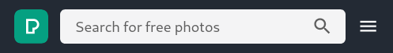
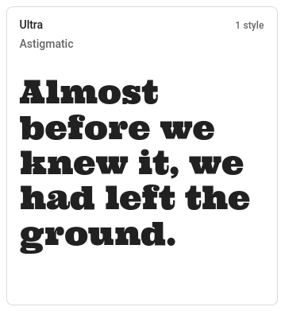
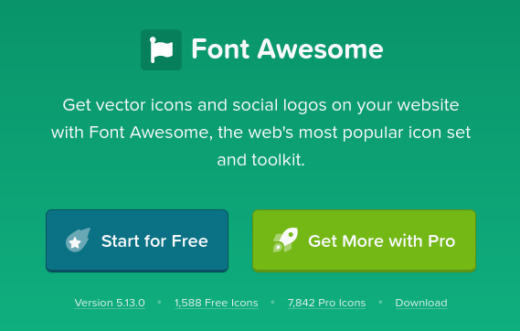
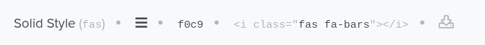

# SVGs & Font Awesome


## Vector Images vs Raster

So far we've been only using raster images in website, however, vector images are also widely used due to their light weight and native responsiveness.

<br>

One of the images below is a raster image and the other is a vector image.


<p align="center"><a href="https://www.flaticon.com/authors/eucalyp" title="Eucalyp"><em>Eucalyp</a> from <a href="https://www.flaticon.com/" title="Flaticon"> www.flaticon.com</em></a></p>

<br>

The vector image above has 3.7 kB in size while the raster equivalent has 9.5 kB. This is a 2.5x size difference.

<br>

> In addition to creating images with perfect definition, vector images are generally much smaller in size than raster formats.

<br>

## SVG Anatomy

[Scalable Vector Graphics (SVG)](https://developer.mozilla.org/en-US/docs/Web/SVG) is a markup language based on [XML](https://developer.mozilla.org/en-US/docs/Web/XML/XML_introduction) used to describe vector images. It shares many similarities with HTML.

<br>

Try to notice the similarities between SVGs and HTML:

<br>

```html
<svg width="300" height="200" version="1.1" baseProfile="full" >
      <rect width="100%" height="100%" fill="black" />
      <circle cx="150" cy="100" r="90" fill="blue" />
</svg>
```

<div style="text-align: center;" class="wrapper">
  	<svg version="1.1" baseProfile="full" width="300" height="200">
          <rect width="100%" height="100%" fill="black" />
          <circle cx="150" cy="100" r="90" fill="blue" />
	</svg>
</div>


<br>

In the svg above, `cx` and `cy` are the coordinates of the center of the circle. `r` is the radius.

<br>

## Using SVG's

There are 3 main ways to include SVG's in a webpage:

- Importing as an `` source;
- As an inline element inside the HTML; 
- Using an external stylesheet that injects the SVG via CSS (such as Font Awesome).


<br>

### SVG's in `` elements

The simplest way to use a SVG is by including it inside a `` element:

<br>

```html

```


<p align="center"><a href="https://www.flaticon.com/free-icon/data_1197409"><em>Data free icon by Flaticon</em></a></p>
<br>

There is one important step to using SVGs which is not needed in raster images:

<br>

> By default, raster images will render in their natural size.
>
> **Vector images don't always have a set size**. If you don't set their size, SVG's might grow to **take all available space**.


<br>

**Remember to set the size of the SVG image**. You can do this in two ways:

- With the inline `widght` and `height` attributes on the `<svg>` element;
- By using styling via CSS.

<br>

<iframe height="305" style="width: 100%;" scrolling="no" title="wk10 - svg_img - Ex4" src="https://codepen.io/maujac/embed/vYNLjVe?height=305&theme-id=light&default-tab=html,result" frameborder="no" allowtransparency="true" allowfullscreen="true" loading="lazy">
  See the Pen <a href='https://codepen.io/maujac/pen/vYNLjVe'>wk10 - svg_img - Ex4</a> by Mauricio Buschinelli
  (<a href='https://codepen.io/maujac'>@maujac</a>) on <a href='https://codepen.io'>CodePen</a>.
</iframe>
<br>


### Inline SVGs


<iframe height="286" style="width: 100%;" scrolling="no" title="wk10 - svg_img_inline - Ex5" src="https://codepen.io/maujac/embed/OJyMBvY?height=286&theme-id=light&default-tab=html,result" frameborder="no" allowtransparency="true" allowfullscreen="true" loading="lazy">
  See the Pen <a href='https://codepen.io/maujac/pen/OJyMBvY'>wk10 - svg_img_inline - Ex5</a> by Mauricio Buschinelli
  (<a href='https://codepen.io/maujac'>@maujac</a>) on <a href='https://codepen.io'>CodePen</a>.
</iframe>


<br>

**With inline SVGs it is possible to style elements inside the SVG via CSS.**


First you must tag the element to be styled with an ID or a class:

<br>

<iframe height="382" style="width: 100%;" scrolling="no" title="wk10 - inlineSVG_CSS - Ex6" src="https://codepen.io/maujac/embed/PoPZyXr?height=382&theme-id=light&default-tab=result" frameborder="no" allowtransparency="true" allowfullscreen="true" loading="lazy">
  See the Pen <a href='https://codepen.io/maujac/pen/PoPZyXr'>wk10 - inlineSVG_CSS - Ex6</a> by Mauricio Buschinelli
  (<a href='https://codepen.io/maujac'>@maujac</a>) on <a href='https://codepen.io'>CodePen</a>.
</iframe>


<br>

## SVG's "in the wild"

The two websites below are a great source of SVG's that are free to use (attribution required):

- [Flaticon.com](https://www.flaticon.com/)
- [freesvg.org](https://freesvg.org/)

<br>

To see an SVG in production let's look at the logo of the [Pexels Video website](https://www.pexels.com/videos):

<br>



<br>

This nav bar uses three different SVG's: the Pexels logo (left) and two icons (search and hamburger menu on the right).

<br>

When we **inspect the logo** we find the following (after removing non-relevant attributes):

<br>

```css
<a class="main-nav-bar__logo" href="/" title="Free Stock Photos">
	<div class="main-nav-bar__logo__img">
		<svg xmlns="http://www.w3.org/2000/svg" width="32px" height="32px" viewBox="0 0 32 32">
			<path d="M2 0h28a2 2 0 0 1 2 2v28a2 2 0 0 1-2 2H2a2 2 0 0 1-2-2V2a2 2 0 0 1 2-2z" fill="#05A081"></path>
        	<path d="M13 21h3.863v-3.752h1.167a3.124 3.124 0 1 0 0-6.248H13v10zm5.863 2H11V9h7.03a5.124 5.124 0 0 1 .833 10.18V23z" fill="#fff"></path>
        </svg>
    </div>
</a>
```


<br>

Note the following:

- Everything is wrapped in an `<a>` tag which will lead you to the root directory "/", where index.html is located.
- The `<svg>`  has a defined size and is wrapped in an `<div>` for styling purposes but that is not strictly necessary.
- There are only two `<path>`s inside the SVG and we can see their colors.

<br>

For the  other SVG's that are icons:

<br>

```html
<button class="js-nav-ham main-nav-bar__sub-nav__item">
    <i>
        <svg xmlns="http://www.w3.org/2000/svg" width="24" height="24" viewBox="0 0 24 24">
            <path d="M3 18h18v-2H3v2zm0-5h18v-2H3v2zm0-7v2h18V6H3z"></path>
        </svg>
    </i>
</button>
```


<br>

In this case:

- Instead of a `<a>` tag the outer element is a `<button>`, but they serve a similar function.
- The svg is wrapped in an `<i>` which is a simple `inline` element. This means you can have elements on the same line.
- The svg has a set `height` and `width`.
- The `xmls` attribute specifies the version of this SVG standard.


<br>


## SVG Icons with Font Awesome

Most [computer type fonts](https://en.wikipedia.org/wiki/Computer_font) used today are drawn using vector images.

When a new font is imported into a page we are "teaching" the browser how to "draw" the font with vectors.

<br>



<p align="center"><a href="https://fonts.google.com/"><em>Google Fonts</em></a></p>
<br>

For example, using Google fonts we ask the browser to import an external style sheet with the instruction on how to render a particular font:

```html
<!-- In the HTML <head> section -->
<link href="https://fonts.googleapis.com/css2?family=Ultra&display=swap" rel="stylesheet"> 
```

```css
/* In the CSS */
font-family: 'Ultra', serif;
```

<br>


> Font Awesome works in exactly the same principle, however, **instead of teaching the browser how to draw a font character, you teach it how to draw an icon.**


<br>

The icon is inserted in the document by targeting a specific class name, similarly to using the `::before`  pseudo-element selector.

<br>

To illustrate this, observe the use of `::before` in the code below:


<br>

```html
<p class="text"> My paragraph. </p>
<ul>
    <li> <a class="target" href="#">Link Item 1</a> </li>
    <li> <a href="#">Link Item 2</a> </li>
</ul>
<p>Inline <span class="target"></span> elements are <i class="target"></i> great! </p>
```


<iframe height="342" style="width: 100%;" scrolling="no" title="wk10 - fontAwesome - Ex7" src="https://codepen.io/maujac/embed/MWayYgB?height=342&theme-id=light&default-tab=css,result" frameborder="no" allowtransparency="true" allowfullscreen="true" loading="lazy">
  See the Pen <a href='https://codepen.io/maujac/pen/MWayYgB'>wk10 - fontAwesome - Ex7</a> by Mauricio Buschinelli
  (<a href='https://codepen.io/maujac'>@maujac</a>) on <a href='https://codepen.io'>CodePen</a>.
</iframe>


<br>

>  **Emojis are a great example of font icons**


### Using Font Awesome





<br>


**[Font Awesome 5](https://fontawesome.com/) :**

1. Create an account and get the `<script>` tag that will be generated for you.

- With this unique script you can create custom "icon kits" customized to your project.

  ```html
  <script src="https://kit.fontawesome.com/20d18bedad.js" crossorigin="anonymous"></script>
  ```

  

<br>

2. Find a icon that you like and **make note of it's class names** (Ex.: [**bars** hamburger menu](https://fontawesome.com/icons/bars?style=solid))

   <br>

   

   

   

   

   <br>

   In this case there are two class names to be added:

   -  `fas` - mandatory for all Font Awesome 5 solid icons.
   - `fa-bars` - unique to this icon.

   <br>

2. Add those classes to an `inline` element such as `<i>` or `<span>`:

   

   ```html
   <head>
       <script src="https://kit.fontawesome.com/20d18bedad.js" crossorigin="anonymous"></script>
   </head>
   
   <body>
       <header>     
           <p> The Hamburger menu <i class="fas fa-bars"></i></p>  
     </header>
   </body>
   ```

   

   <iframe height="183" style="width: 100%;" scrolling="no" title="wk10 - fa_bars_hamburger - Ex8" src="https://codepen.io/maujac/embed/eYpZNpp?height=183&theme-id=light&default-tab=css,result" frameborder="no" allowtransparency="true" allowfullscreen="true" loading="lazy">
     See the Pen <a href='https://codepen.io/maujac/pen/eYpZNpp'>wk10 - fa_bars_hamburger - Ex8</a> by Mauricio Buschinelli
     (<a href='https://codepen.io/maujac'>@maujac</a>) on <a href='https://codepen.io'>CodePen</a>.
   </iframe>

   

<br>

> To see a more detailed guide to using Font Awesome 5, visit **[Font Awesome 5 Introduction](https://www.w3schools.com/icons/fontawesome5_intro.asp)** by W3C Schools


<br>

#### Limitations of vector images

Because all shapes in vector images must be described mathematically, they cannot be used to capture real-life pictures.

<br>

SVG images are best used for:

- Logos
- Charts
- Drawings and Illustrations
- Icons

<br>

> A photograph cannot be exported to svg. It must be "constructed" into an svg approximation.

Conversion programs exist but can only take you so far.

<br>


<br>

## References & Diving Deeper

Recommended readings:


 -   **[Video and audio content](https://developer.mozilla.org/en-US/docs/Learn/HTML/Multimedia_and_embedding/Video_and_audio_content)** by MDN web docs.
 -   **[Adding vector graphics to the Web]()** by MDN web docs.


Recommended videos:

<br>

<iframe width="560" height="315" src="https://www.youtube.com/embed/ZJSCl6XEdP8" frameborder="0" allow="accelerometer; autoplay; encrypted-media; gyroscope; picture-in-picture" allowfullscreen></iframe>
<br>

If you want to see the power of SVGs, animations and art, I highlight recommend the video below:

<br>

<iframe width="560" height="450" src="https://www.youtube.com/embed/8p5SDI4TNDc" frameborder="0" allow="accelerometer; autoplay; encrypted-media; gyroscope; picture-in-picture" allowfullscreen></iframe>
<br>


## Hands-on


### Exercise 1


Using Font Awesome, insert the following icons **on the same line** inside the `<header>` section of the code provided:

- [Search](https://fontawesome.com/v4.7.0/icon/search) icon
- [Shopping](https://fontawesome.com/v4.7.0/icon/shopping-cart) cart


<iframe height="245" style="width: 100%;" scrolling="no" title="wk10 - Exercise 1" src="https://codepen.io/maujac/embed/OJyNVoY?height=245&theme-id=light&default-tab=html,result" frameborder="no" allowtransparency="true" allowfullscreen="true" loading="lazy">
  See the Pen <a href='https://codepen.io/maujac/pen/OJyNVoY'>wk10 - Exercise 1</a> by Mauricio Buschinelli
  (<a href='https://codepen.io/maujac'>@maujac</a>) on <a href='https://codepen.io'>CodePen</a>.
</iframe>


<br>

### Exercise 2


Using Flaticon, insert this ["settings" SVG icon](https://www.flaticon.com/free-icon/settings_126472) inside the `<article>` section using the two methods below:

- Inline SVG

- External SVG (`` element)

  

Try to change the color of the inline SVG to blue;


<br>

<iframe height="204" style="width: 100%;" scrolling="no" title="wk10 - Exercise 2" src="https://codepen.io/maujac/embed/MWaywMJ?height=204&theme-id=light&default-tab=html,result" frameborder="no" allowtransparency="true" allowfullscreen="true" loading="lazy">
  See the Pen <a href='https://codepen.io/maujac/pen/MWaywMJ'>wk10 - Exercise 2</a> by Mauricio Buschinelli
  (<a href='https://codepen.io/maujac'>@maujac</a>) on <a href='https://codepen.io'>CodePen</a>.
</iframe>


