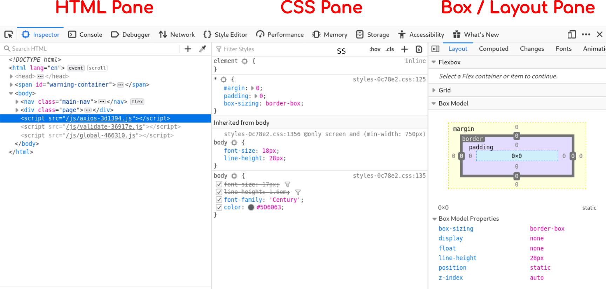
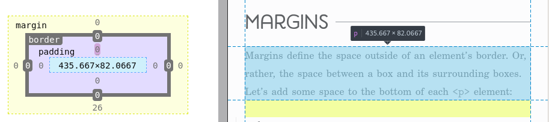
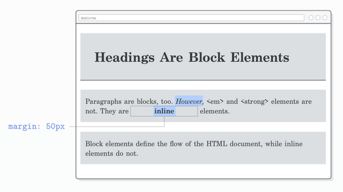
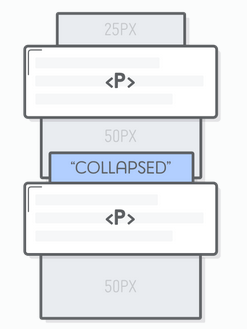

# 

*This lesson was based on the page **[CSS Box Model](https://internetingishard.com/html-and-css/css-box-model/)** by Interneting is Hard.*


# The Box Model


The size of an element in a webpage is described by

- **Content**
- **Padding**
- **Border**
- **Margin**


> The Box model is the combination of margin, border, padding and content of an element, which determines how much space each element will take on the page.

<br>


 


## Block vs Inline Elements

[Remember from week 3](../wk3/wk03_HTML_Flow_Containers.md) that **certain elements are of type Inline while other elements are of type block-level.**

This characteristic determines the space that is allocated to them in the document flow.


<p align="center"><a href="https://learn-the-web.algonquindesign.ca/topics/css-layout-cheat-sheet"><em>CSS layout cheat sheet</em></a> <em>- algonguindesign.ca</em></p>
<br>


# Browser Dev Tools

There are built-in tools in our browser to help us inspect elements and visualize their box properties.

> **In Firefox or Chrome press `F12` to open the Developer's Console**

<br>



<br>

Once the Dev Tools are open, select the **Inspector Picker**  or press `Shift` + `Ctrl` + `C`  to inspect elements in the page.


<br>


To learn more about the Dev Tools visit  [this link for the Firefox Dev Tools](https://developer.mozilla.org/en-US/docs/Tools/Page_Inspector/UI_Tour) or [this link for the Chrome Dev Tools](https://developers.google.com/web/tools/chrome-devtools/).


> **The Box Pane of the Dev Tools is a great cheat-sheet** if you forget the order of the border, margin and padding in the box model:
>
> 


# Manipulating the Box


!>  For this section we will refer to the page **[CSS Box Model](https://internetingishard.com/html-and-css/css-box-model/)** by Interneting is Hard.


In the section we will cover:

- Changing the box behaviour;
- Padding
- Margins
- Vertical Margin Collapse
- Content vs Border Boxes (`box-sizing`)
- Aligning Boxes (an introduction)
- Resetting Styles


> Follow the activity in the referenced article in order to create the demo below by manipulating the box properties.

<br>


<br>


0. Start with the HTML and CSS below:

   ```html
   <!DOCTYPE html>
   <html lang='en'>
     <head>
       <meta charset='UTF-8'/>
       <title>Boxes Are Easy!</title>
       <link rel='stylesheet' href='box-styles.css'/>
     </head>
     <body>
       <h1>Headings Are Block Elements</h1>
   
       <p>Paragraphs are blocks, too. <em>However</em>, &lt;em&gt; and &lt;strong&gt;
          elements are not. They are <strong>inline</strong> elements.</p>
   
       <p>Block elements define the flow of the HTML document, while inline elements
          do not.</p>
     </body>
   </html>
   ```

   ```css
   h1, p {
     background-color: #DDE0E3;    /* Light gray */
   }
   
   em, strong {
     background-color: #B2D6FF;    /* Light blue */
   }
   ```


## Display: Changing the Box Behaviour


> **It is possible to change the flow behaviour of an element from Inline to Block-level and vice-versa.**
>
> This is achieved with the [`display` property](https://www.w3schools.com/cssref/pr_class_display.asp) in CSS.


| Value    | Description                                                  |
| -------- | ------------------------------------------------------------ |
| `inline` | Displays an element as an inline element (like `<span>`). Any height and width properties will have no effect. |
| `block`  | Displays an element as a block element (like `<p>`). It starts on a new line, and takes up the whole width. |


<br>

1. **Temporarily** change the `display` property of the `<em>` and the `<strong>` elements to `block`.

   ```css
   em, strong {
     background-color: #B2D6FF;
     display: block;
   }
   ```

   

2. Once you've observed the change above, **revert the display property**  by setting `display: inline` (the default for `<em>` and `<strong>`).


# Padding

3. Add an **all-around padding** to the `<h1>` element:

   ```css
   h1 {
     padding: 50px;
   }
   ```

   

4. Use the **Element Inspector from the Dev Tools** to observe the padding;

   

5. Use the shorthand notation to the padding of the `<p>` element:

   ```css
   p {
     padding: 20px 0 20px 10px;  /* Top  Right  Bottom  Left */
   }
   ```

   <br>

   When **four values are provided** the shorthand order is T.R.B.L. ( read *"trouble"*), or clockwise.

   - **1st value** is top;

   - **2nd value** is right;

   - **3rd value** is bottom;

   - **4th value** is left;

   

   

<br>

When **two values are provided** for a shorthand notation:

- **1st value** is top & bottom;
- **2nd value** is left &right;


6. Use the **Element Inspector ** in the Dev Tools to observe the padding difference between the four directions.

   

<br>

# Borders


​	[From the previous lesson](./wk4_1_background_heroes_border.md#Border) , the **shorthand notation for the border property** is:

​	

​	<br>

8. Add a border to the around the `<h1>` element:

   ```css
h1 {
	  padding: 50px;
	  border: 1px solid #5D6063;   /*  Shorthand notation for the border  */
	}
	```
	


9. Change the full-border behaviour **on the `<h1>` element** to a single border by specifying the bottom direction:

   ```css
   border-bottom: 1px solid #5D6063;
   ```

<br>

# Margins

Margins create space between the selected element and neighbouring elements.




<br>


10. Add a bottom margin to the `<p>` element:

   ```css
   p {
     padding: 20px 0 20px 10px;
     margin-bottom: 50px;
   }
   ```

   

11. Use the Element Inspector in the Dev Tools to observe the margin.


### Margins vs Padding

At a first glance Margins and Padding might seem very similar, but they have some important differences:

> - The padding of a box has a background, while margins are  always transparent.
> - Padding is included in the click area of an element, while margins aren’t.
> - Margins collapse vertically, while padding doesn’t (more below).


If you are unsure of which one to use, **experiment with both** and observe the difference.


### Inline vs Block: Margins & Padding


**Margins behave slightly differently for Inline vs Block element.**

> **Margins for inline elements:**
>
> - top and bottom margins are ignored.
>
> - horizontal margins behave normally.
>
> **Padding for inline elements:**
>
> - padding is applied in all directions but does not affect the vertical layout.
>
> 
>
> **Summary:** the vertical spacing of inline elements is not affected by its box margins, padding or border). 


<br>

12. Add a margin to the `<strong>` element:

    ```css
    strong {
      margin: 50px;
    }
    ```

    

13. Use the Element Inspector in the Dev Tools to observe the margin.

    - From here on I refer to this step simply as "**Inspect it**".
    

<br>

At this point, your page should look like this:




14. **Temporarily** add a padding and a border to the `<strong>` element, **and inspect it.**

    

   ```css
strong {
    margin: 50px;
	padding: 50px;
	border: 2px solid red;
}
   ```

   

> **Remember:** the vertical spacing of inline elements is not affected by its box. 


# Display: Inline-block

As seen above, we can change the display behaviour of an element between Inline and Block.

> **There is a hybrid  [`display`](https://www.w3schools.com/cssref/pr_class_display.asp) value of `inline-block`,** which will:
>
> - Make an element respect the document inline flow without a line-break
>   - Ex.: multiple elements per line.
> - Force all box properties (padding, border and margin) to take vertical and horizontal space.
>   - Ex.: pushing neighbouring elements away in all four directions


These are the 3 values of the [`display`](https://www.w3schools.com/cssref/pr_class_display.asp) property we have used so far:


| Value          | Description                                                  |
| -------------- | ------------------------------------------------------------ |
| `inline`       | Displays an element as an inline element (like `<span>`). Any height and width properties will have no effect. |
| `block`        | Displays an element as a block element (like `<p>`). It starts on a new line, and takes up the whole width unless specified by the  `width` property. |
| `inline-block` | Displays an element as an inline block-level container. The element itself is formatted as an box element, and you can apply height and width values. |

<br>

15. Change the display value of the `<strong>` element to `inline-block` **and inspect it.**

```css
strong {
	padding: 50px;
	border: 2px solid red;
	margin: 50px;
    display: inline-block;
}
```


16. **Remove** the `padding` ,  `border`  and the `display` properties added to the  `<strong>` element.


# Vertical Margin Collapse

The vertical margin collapse can be a **counter-intuitive behaviour** in CSS.


> When two block-level elements are stacked vertically and both have a padding that "touch", the smaller of the two margins will "collapse" inside the larger padding.





<br>

16. Add a top margin to the `<p>` element (it already had a bottom margin):

```css
p {
	padding: 20px 0 20px 10px;
    margin-bottom: 50px;
  	
    margin-top: 25px;
}
```


17. Inspect the neighbouring `<p>` elements and identify what is the actual margin between them.


## Dealing with Vertical Margin Collapse

There are three approaches to dealing with the vertical margin collapse:

> - Embrace it and take it into consideration when designing your spacing (recommended).
>
>   - Ex.: Adopt a convention system of top-only or bottom-only margins.
>
>     
>
> - Use padding to add spacing since it never collapses.
>
>   - Only works if you are not using padding for something else
>
>     
>
> - Use a div with padding-top: 1px to act as a buffer and "clear" the collapse (not recommended)


**Note:** Flexbox does not have collapsing margins so this won't be a problem once we learn it. #webdev2020


# Explicit Dimensions: Width & Height


> By default, a container will grow or shrink automatically according to it's content, however, you can explicitly define its dimension with the properties `width` and `height`.


18. Create a div container at the bottom of your html file and add the following style to the css file:

    *HTML*

    ```html
    <!--  The rest of the html document -->
    
    <div>Button</div>
    ```

    *CSS*

    ```css
    div {
      color: #FFF;
      background-color: #5995DA;
      font-weight: bold;
      padding: 20px;
      text-align: center;
      border: 2px solid #5D6063;
      border-radius: 5px;
    }
    ```


<br>

Since the `<div>` is a block-level element, it will take the entire width of the view port by default:

<br>


19. Explicitly define the width of the `<div>` element to be 200px:

    ```css
    div {
        
      /* [Existing Declarations] */
        
      width: 200px;
    }
    ```


<br>

Now that the div is smaller than the view-port width, it will by default "justify" left:


> Now that a explicit width has been defined (locked-in), the div will always keep it's width (200px) and will grow vertically in order to accommodate new content:
>
> 
>
> 


<br>

# Content vs Border Boxes

> The `width` and the `height` properties define the size of the box's content. 
>
> **By default, padding and border dimensions are added on top of the content dimensions to define the final box size.**  
>
> This creates a box bigger than the dimensions explicitly defined by `width` and `height`.


The auto-sizing behaviour is determined by the property `box-sizing`, which has the default value of `content-box`.


> In order to include the padding and border in an element's total width and height we must set the property `box-sizing` to `border-box`.


<br>

In the [demo bellow from MDN web docs](https://developer.mozilla.org/en-US/docs/Web/CSS/box-sizing) you can manipulate the `box-sizing` properties of the Child container.

- Notice how the child container will overflow its parent container if the width is the to 100% (of the parent's width) and there is a border and padding thickness.

<br>


<iframe class="interactive" src="https://interactive-examples.mdn.mozilla.net/pages/css/box-sizing.html" title="MDN Web Docs Interactive Example" width="100%" height="400" frameborder="0"></iframe>


To learn more about the `box-sizing` property see [CSS Box Sizing tutorial](https://www.w3schools.com/css/css3_box-sizing.asp) by W3Schools.


<br>


20. Inspect the `<div>` element and observe it's box size. What is it's total box size in the screen (including  border and padding)?

    

21. Change the `box-sizing` property to `border-box`. 

    ```css
    div {
    	color: #FFF;
    	background-color: #5995DA;
    	font-weight: bold;
    	padding: 20px;
    	text-align: center;
    	border: 2px solid #5D6063;
    	border-radius: 5px;
    	width: 200px;
    	
        box-sizing: border-box;  /* Add this */
    }
    
    ```

    

22. Inspect the `<div>`. What is the new total box size of the element ?


> Changing the box sizing to `border-box` is considered a best practice.
>
> This is usually done at the beginning of the project using a CSS reset (see below).


# Intro to Aligning Boxes

There are several ways to align text and containers in CSS. We will look at two techniques (one you've already seen, and one new).

> It is important to make a distinction between block-level alignment and text alignment.
>
> They are unrelated and will behave differently.


## Aligning Text

[In week 3 (Text Layout & Alignment)](../wk3/wk3_3_text_units.md)  we looked at how to align text within it's parent container using the `text-align` property.


> **Text-align property will only align the text inside a container, not the container itself.**


<br>

23. Add the `text-align` property with the value of `center` to the body of the document:

```css
body {
  text-align: center;
}
```


<br>

## Aligning Boxes with Auto-Margins

There are three methods for horizontally aligning block-level elements:

- **"auto-margins"** for center alignment;
- **"floats"** for left/right alignment (not recommended);
- **"flexbox"** for complete control over alignment (we will learn it later in the course).


We will not learn about floats in this course since it's "hacky", error prone and flexbox has made it obsolete.


> Once the size of a container is specified using `width` the `margin` property can be set to `auto`.
>
> The value `auto` will automatically increase the margins of the container to occupy the available space.
>
> **Auto-margin on block-level containers will only work horizontally if `width` has been specified.**


!> Auto-margins do not work for vertical alignment. At this point use margins or paddings for vertical positioning. Flexbox will solve this problem in the future.


**Again:** If a width is not explicitly declared for a block level container it will by default take the full width of the browser, making “center alignment” meaningless.

<br>

24. Add a horizontal auto-margin to the div and inspect it's margins.
    - What are the margins values ?

```css
div {
	color: #FFF;
	background-color: #4A90E2;
	font-weight: bold;
	padding: 20px;
	text-align: center;
    width: 200px;
	box-sizing: border-box;
	
    margin: 20px auto; /* Vertical  Horizontal */
}
```


<br>

Your page should now look similar to this:


<br>


# References & Diving Deeper

> Recommended reading: **[CSS Box Model](https://internetingishard.com/html-and-css/css-box-model/) by Interneting is Hard**.


Other resources:

- [The box model](https://developer.mozilla.org/en-US/docs/Learn/CSS/Building_blocks/The_box_model) by MDN web docs
- [CSS Box Sizing](https://www.w3schools.com/css/css3_box-sizing.asp) by W3Schools


# Hands-on

## Exercises

1. Do the following exercises from W3Schools:

   - [CSS Padding](https://www.w3schools.com/Css/exercise.asp?filename=exercise_padding1)
   - [CSS Margin](https://www.w3schools.com/Css/exercise.asp?filename=exercise_margin1)
   - [CSS Height/Width](https://www.w3schools.com/Css/exercise.asp?filename=exercise_dimension1)
	- [CSS Box Model](https://www.w3schools.com/Css/exercise.asp?filename=exercise_boxmodel1)

<br>

2. **CSS Box Model extended**. Continuing from the completed [Exercise 4 of the CSS Box Model](https://www.w3schools.com/Css/exercise.asp?filename=exercise_boxmodel4), perform the following tasks:

   

   - Add a top margin of 2 rem to the div;

   - Center the div horizontally in the document;

   - To the `body` element add a height of 400px and set the `background-color` to green;

   - Inspect the `body` element. What is happening to the background-color ?

   <br>

3. Complete the [Boxer Model Challenge from Khan Academy](https://www.khanacademy.org/computing/computer-programming/html-css/css-layout-properties/pc/challenge-the-boxer-model)

   <br>

