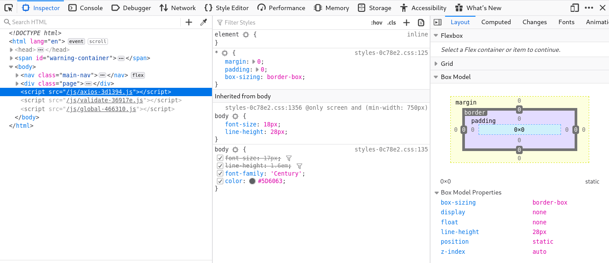
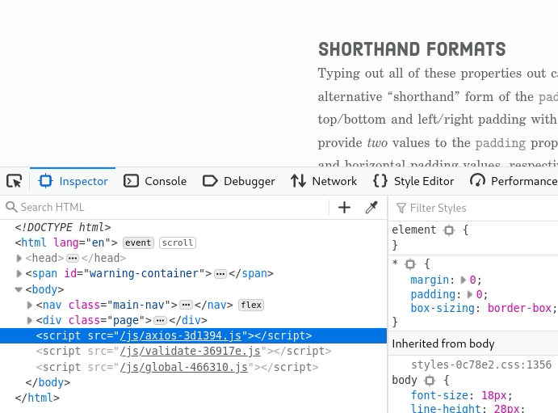
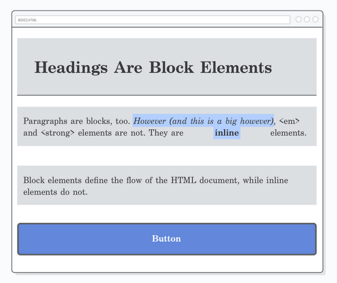

#

# The Box Model


The size of an element in a webpage is described by

- **Content** inside the element;
- **Padding** around the content;
- **Border** around the padding;
- **Marging** around the borders;


> The Box model is the combination of margin, border, padding and content of an element, which determines how much space each element will take on the page.


 


## Block vs Inline Elements

[Remember from week 3](../wk3/wk03_HTML_Flow_Containers.md) that certain elements are of type Inline while other elements are of type block-level.

This determines the space that is allocated to them in the document flow.


<p align="center"><a href="https://learn-the-web.algonquindesign.ca/topics/css-layout-cheat-sheet"><em>CSS layout cheat sheet</em></a> <em>- algonguindesign.ca</em></p>
<br>


# Browser Dev Tools

There are build-in tools in our browser to help us inspect elements and visualise their box properties.

**In either Firefox or Chrome press `F12` to open the Developer's Console**

<br>



<br>

Once the Dev Consolde is open, press `Shift` + `Ctrl` + `C`  or select the **Inspector Picker** to inspect elements in the page.

<br>



<br>


# Manipulating the Box


!>  For this section we will refer to the page **[CSS Box Model](https://internetingishard.com/html-and-css/css-box-model/)** by Interneting is Hard.


In the section we will cover:

- Changing the box behaviour;
- Padding
- Margins
- Vertical Margin Collapse
- Content vs Border Boxes (`box-sizing`)
- Aligning Boxes (an introduction)
- Resetting Styles


> Follow the activity in the page to create the page below and manipulate the box properties of it's elements




## Changing the Flow Behaviour

**It is possible to change the flow behaviour of an element from Inline to Block-level and vice-versa.**


This is achieved with the [`display` property](https://www.w3schools.com/cssref/pr_class_display.asp) in CSS.


| Value          | Description                                                  |
| -------------- | ------------------------------------------------------------ |
| `inline`       | Displays an element as an inline element (like `<span>`). Any height and width properties will have no effect. |
| `block`        | Displays an element as a block element (like `<p>`). It starts on a new line, and takes up the whole width. |
| `inline-block` | Displays an element as an inline-level block container. The element itself is formatted as an element, but you can apply height and width values. |

<br>


> There are many other possible values for the `display` property but for now we will focus on the three above

<br>

# List Styles

!>  For this section we will refer to the page **[CSS Lists](https://www.w3schools.com/css/css_list.asp)** by W3Schools.

Using the reference above, look at the following CSS properties:

| Property                                                     | Description                                                  |
| ------------------------------------------------------------ | ------------------------------------------------------------ |
| [list-style ](https://www.w3schools.com/cssref/pr_list-style.asp) (shorthand) | Sets all the properties for a list in one declaration        |
| [list-style-image](https://www.w3schools.com/cssref/pr_list-style-image.asp) | Specifies an image as the list-item marker                   |
| [list-style-position](https://www.w3schools.com/cssref/pr_list-style-position.asp) | Specifies the position of the list-item markers (bullet points) |
| [list-style-type](https://www.w3schools.com/cssref/pr_list-style-type.asp) | Specifies the type of list-item marker                       |


## List Style Position

Note that the **default value** of `list-style-position` is `ouitside`.

This means two things:

-  the markers will fall **outside the list items but inside the list itself**
- The **list items have a left padding** (empty space) by default.

*Code*:

```css
ul {
    border: solid 1px gray;
    width: 200px;
}
li {
    border:solid 1px blue;
}
```

*Result*:

<ul style="border:solid 1px gray; width:200px">
  <li style="border:solid 1px blue;">Coffee</li>
  <li style="border:solid 1px blue;">Tea</li>
  <li style="border:solid 1px blue;">Coca Cola</li>
</ul>

<br>

> Its common practice to use list-items in a navigation bar by resetting their default values:


```css
ul {
    list-style: none;
    padding: 0px;
    width: 200px;
}
li {
    background-color: #6287DB;
    color: white;
    text-align: center;
    border-raidius: 10px;
    padding: 0.8rem;
    margin: 0.4rem;
}
```

<ul style="list-style: none; padding: 0px; width:200px">
  <li style="background-color: #6287DB; color: white; text-align: center; border-radius: 10px; padding: 0.8rem; margin: 0.4rem;">Home</li>
  <li style="background-color: #6287DB; color: white; text-align: center; border-radius: 10px; padding: 0.8rem; margin: 0.4rem;">Products</li>
  <li style="background-color: #6287DB; color: white; text-align: center; border-radius: 10px; padding: 0.8rem; margin: 0.4rem;">Contact</li>
</ul>


In the example above the shorthand notation was used with only one value. **For non-specified values, their default values are loaded.**