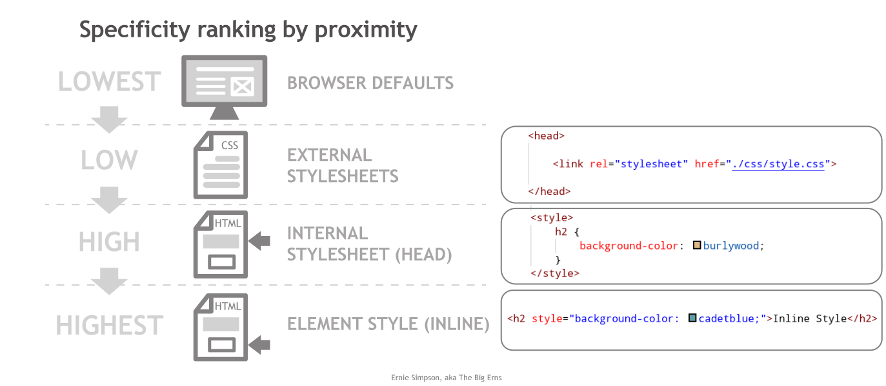

# The Cascade

The first "C" in CSS stands for Cascade, which is **the way how the browser will prioritise competing styles**.

<br>


There are four important concepts which are part of the Cascade:

<br>

<dl style="border: 1px solid gray; padding: 20px 20px 30px 20px; border-radius: 20px;
:">
    <dt><strong>Inheritance</strong></dt>
    <dd>Whether or not values are inherited from their parents.</dd>
    <br>
    <dt><strong>Source Origin</strong></dt>
    <dd><strong>Origin</strong>: where the rule was defined.</dd>
    <dd><strong>Order</strong>: the sequential order in which the style was positioned.</dd>
    <br>
    <dt><strong>Specificity</strong></dt>
    <dd>How specific a selector is.</dd>
    <br>
    <dt><strong>Importance</strong></dt>
    <dd>The type of style rule being applied (only mentiones here).</dd>
</dl>


## Inheritance

Depending on the element, some CSS properties are inherited from it's parent container and some set to it's default values.


For example, `color` and `font-family` are inherited from the parent element. The properties `width` and `border-radius` are not inherited.


> The best way to know whether or not a property will be inherited from it's parent is to check the documentation in W3Schools or MDN web docs.


**[Check this list to see the default browser values of most elements.](https://www.w3schools.com/cssref/css_default_values.asp)**


It is possible to control an element's inheritance by using the following CSS values:

- `inherit`: use the same value as the parent.
- `initial`: use the default values set by the browser.
- `unset`: reset to it's original value (see table on link above).

<br>

As an example:

```css
/* Set all h2's to green */
h2 { color: green; }

/* the h2's inside #sidebar get the color from their parent */
#sidebar h2 { color: inherit; }
```


## Source Origin

The location and order in which CSS properties are declared determine their priority.


### Origin Location

If there are conflicting CSS declarations, **the order of priority is as follows** (from least to most priority):

1. Browser Defaults (also called **user-agent**)
2. External Stylesheets
3. Internal Styles
4. Inline Styles

<br>



<p align="center"><a href="https://cssway.thebigerns.com/special/master-item-styles/"><em>The effect of Proximity on Specificity value in the Cascade Order</em></a></p>


<br>

### Order of declaration

The priority also depends on the order of declaration. **The last rule to be set wins**.

The order is determined using the conventional reading direction:

- Top to Bottom.
- Left to Right.

This priority order is applied for styles declared externally, internally or in-line.

<br>

Consider a HTML file linked to two css stylesheets that contain overlapping properties:

```html
<link rel="stylesheet" href="./css/first_styles.css">
<link rel="stylesheet" href="./css/second_styles.css">
```

The stylesheet declared last will have priority.

<br>

See other examples of priority by order of declaration:

<br>

*Code*

```css
h3 { color: red; }
h3 { color: blue; }
```

```html
<h3>Top to Bottom</h3>
```

*Result*

<h3 style="color: blue;">Top to Bottom</h3>
<br>

*Code*

```html
<h3 style="color: blue; color: red;">Left to Right</h3>
```

*Result*

<h3 style="color: blue; color: red;">Left to Right</h3>

## Specificity

Specificity determines which CSS rule is most specific to a particular element.


Every selector has its place in the specificity hierarchy. There are four  categories which define the specificity level of a selector (from lowest to highest):


1. **Elements and pseudo-elements**

   - This category includes element names and pseudo-elements.

   - Ex.: h1, div, :before and :after.

     

2. **Classes, attributes and pseudo-classes**

   - This category  includes .classes, [attributes] and pseudo-classes.

   - Ex.: .button, :hover, etc.

     

3. **IDs**

   - An ID is a unique identifier for the page elements.

   - Ex.: #navbar.

     

4. **Inline styles**

   - An inline style is attached directly to the element to be styled.

   - Ex.:  `<h1 style="color: #ffffff;">`.

<br>

> There is a formal way of determining the specificity of elements using a score system, from 1 to 1000, however, we will not cover here.
>
> For more information see *[How to Calculate Specificity](https://www.w3schools.com/css/css_specificity.asp)* by W3Schools


<p align="center"><a href="https://docs.microsoft.com/en-us/dotnet/architecture/modern-web-apps-azure/common-client-side-web-technologies"><em>CSS Specificity rules, in order</em></a></p>
<br>


<p align="center"><a href="https://cssway.thebigerns.com/special/master-item-styles/"><em>Example of specificity ranking with regard to selector types</em></a></p>
<br>

## Importance

We will not cover importance in this course. It is still helpful to be familiar the concept:

**There are 4 types of CSS rules which determine their importance** (from most to least important):

1. Transition
2. `!important` (property added to the end of a declaration)
3. Animation
4. Normal


# References & Diving Deeper

> Recommended reading: [**Cascade and inheritance**](https://developer.mozilla.org/en-US/docs/Learn/CSS/Building_blocks/Cascade_and_inheritance) page by MDN web docs.


Other resources:

- [The CSS Cascade](https://wattenberger.com/blog/css-cascade#specificity) by Amelia Wattanberger
- [The “C” in CSS: The Cascade](https://css-tricks.com/the-c-in-css-the-cascade/) by CSS-Tricks

  