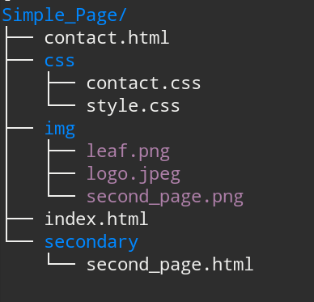
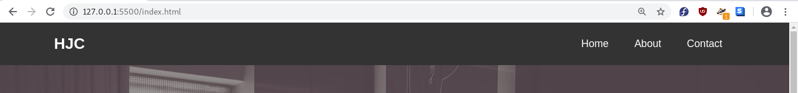
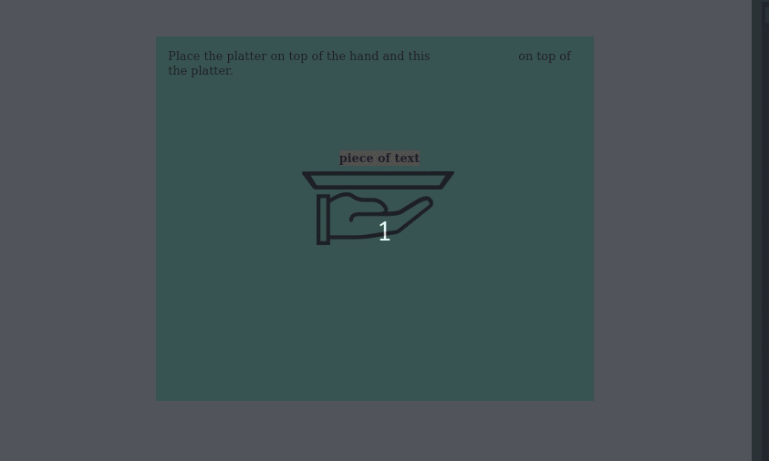

# HTML


### Semantics


Q.1) In the code below, who is the parent of the `<a>` element ?

```html
    <nav>
        <ul>
            <li><a href="#">Home</a></li>
            <li><a href="#">About</a></li>
            <li><a href="#">Contact</a></li>
        </ul>
    </nav>
```

<details>
  <summary>Solution</summary>
  <ul>
    <li>&lt;li&gt;</li>
  </ul>
</details>

<br>

Q.2) What is the relationship between the div element with `id = "selected"` and the `<html>` root element?

```html
<html lang="en">
<head></head>
<body>
    <h1>Title</h1>
    <div id = "selected">
        <h2>Welcome to our site!</h2>
    </div>
</body>
</html>
```


1. The `<div>` element is the child of the root `<html>` element
2. The `<div>` element is the grandparent of the root `<html>` element
3. The `<div>` element is the grandchild of the root `<html>` element
4. The `<div>` element is the sibling of the root `<html>` element

<details>
  <summary>Solution</summary>
  <ul>
    <li>3</li>
  </ul>
</details>

<br>

### Units

Q.3)  What will be the font size in pixels of the `<h1>` and `<p>` elements below ? Please explain why that is.

```html
<!-- Assume that the browser's default font-size is 16px -->
<head>
    <style>
        h1 {
            font-family: 'Rubik', sans-serif;
        }
        main {
            font-size: 18px;
        }
        p{
            font-size: 1rem;
        }
    </style>
    <title>Document</title>
</head>
<body>
    <main>
        <h1>Heading 1</h1>
        <p>Lorem ipsum dolor sit amet consectetur.</p>
    </main>
</body>
```

<details>
  <summary>Solution</summary>
  <ul>
    <li>h1 has font-size of 36px. Most modern browsers have the size of h1 elements set to 2em, which means 2x the like height of the parent element. In this case the parent of h1 is the main element, which has a font-size set to 18px.</li>
    <li>p has a font-size of 16px. rem refers to the root html element, which in this case has a browser default font-size of 16px. </li>
  </ul>
</details>

<br>

Q.3.5) Test your understanding of em, rem, px and & units with the [Em Enforcer exercise](https://activities.learn-the-web.algonquindesign.ca/em-enforcer/) by Alogonquin College.

(For the final 3 or 4 questions, you will need to be familiar with the concepts of Media Queries, which has not yet been covered in class.)


<br>

### Syntax & HTML Elements

Q.4) Which line of HTML code demonstrates an element having an attribute named `title`?

1. `<p id="title"> The Earth is round.</p>`
2. `<p>title</p>`
3. `<p title="each fact"> The Earth is round.</p>`
4. `<p name="title">The Earth is round.</p>`

<details>
  <summary>Solution</summary>
  <ul>
    <li>3. See week 2 for html syntax</li>
  </ul>
</details>

<br>

Q.5) The following code is supposed to display an image, but fails to do so.  Why? 

``

1. The relative path to the image has a syntax mistake.
2. The `` tag can only display .png, .jpeg and .svg image formats.
3. The src attribute is missing and must be set equal to the imge URL.
4. The image URL should be set in single quations marks. 

<details>
  <summary>Solution</summary>
  <ul>
    <li>3</li>
  </ul>
</details>

<br>

### Box Model


Q.6) Match the description with the appropriate elements (place the number beside each of the three elements).

A. Inline element

B. Block-level element

C. Inlike-block element


1. `<span>`
2. ``
3. `<h1>` 
4. `<div>`
5. Will take up the whole width of its parent.
6. Will collapse vertical margins into each-other.
7. Paddings and Margins in the vertical direction are displayed in the page but does not displace elements.
8. Paddings and Margins in the vertical direction will move elements up or down.
9. Multiple elements can be placed in the same line.
10. Can be centered horizontally by applying `text-align: center` to it's parent.


<br>

### Function & Implementing HTML


Q.7) Markup languages use special symbols in human readable text in order to create a hierarchy of information which serves several purposes. Which statement below is not a purpose of html markup:

1. it allows users scanning a site to quickly pick out the most important ideas.
2. it helps visually impaired users navigate the content of a page using special software.
3. it helps search engines pick out important keywords that might otherwise get lost in a sea of text.
4. it helps developers style the document in a dynamic way.

<details>
  <summary>Solution</summary>
  <ul>
    <li>4</li>
  </ul>
</details>

<br>

Q.8) Given the following directory structure, how would one create a link to second_page.html from the page index.html ?



1. `.. / img / second_page.html`

2. `. / secondary / second_page.html`

3. `.. / Simple_Page / second_page.html`
4. `. / img / second_page.png`

<details>
  <summary>Solution</summary>
  <ul>
    <li>2</li>
  </ul>
</details>

<br>

# CSS


### Syntax

Q.9) .Which type of CSS declaration goes in the opening tag of a html element?

1. embedded
2. inline
3. external
4. internal

<details>
  <summary>Solution</summary>
  <ul>
    <li>2</li>
  </ul>
</details>

<br>

Q.10) Which type of selector is used to apply styling to more than one element?

1. id
2. group
3. link
4. class

<details>
  <summary>Solution</summary>
  <ul>
    <li>4</li>
  </ul>
</details>

<br>

Q.11) Which box property configures the empty space between adjacent elements?

1. padding
2. border
3. margin
4. display

<details>
  <summary>Solution</summary>
  <ul>
    <li>3</li>
  </ul>
</details>

<br>

Q.12) This rule is used along with the 'width' property to center page content:

1. margin-left: auto; margin-right: auto;
2. margin: 15 0 0 5;
3. margin: auto 20px;
4. margin: margin 15px 0 5px 0;

<details>
  <summary>Solution</summary>
  <ul>
    <li>1</li>
  </ul>
</details>

<br>

Q.13) Which CSS property can be used to darken a background image ?

1. background-gradient
2. background-image
3. background-clip
4. linear-gradient

<details>
  <summary>Solution</summary>
  <ul>
    <li>4</li>
  </ul>
</details>

<br>

Q.14) This would cause the element not to display...

1. display: block;
2. display: 0px;
3. display: none;
4. display: inline;

<details>
  <summary>Solution</summary>
  <ul>
    <li>3</li>
  </ul>
</details>

<br>

### Browser Defaults


Q.15) Given the code below, why is the color of the `<a>` element not red like it's parent?

*HTML*

```html
<div id="red-section">
    <h3>This container is red</h3>
    <a href="#">Click here for more</a>
</div>
```

*CSS*

```css
#red-section {
    color: red;
}
```

*Result*

<div id="red-section">
    <h3 style="color: red;">This container is red</h3>
    <a href="#">Click here for more</a>
</div>

<details>
  <summary>Solution</summary>
  <ul>
    <li>Because the color property is not being inherited by the anchor element. Instead, the browser applies default styling that make it blue.</li>
  </ul>
</details>

<br>

Q.16) Based on the question above, without using a color code or name, how can we set the color of `<a>` to red? (This was indirectly covered in class).

<details>
  <summary>Solution</summary>
  <ul>
    <li>By setting color: inherit; which would force the anchor element to inherit its color from it's parent.</li>
  </ul>
</details>

<br>

### Flexbox


Q17) Using two different Flexbox alignment techniques, place the target image perfectly in the middle of  the background element.

[Link for target image here](https://www.flaticon.com/free-icon/target_673118?term=aim&page=1&position=5)

```html
<html lang="en">
<head>
    <style>
        section{
            background-color: aquamarine;
            height: 400px;
        }
        img{
            
        }
    </style>
</head>
<body>
	<section >
    	
	</section>
</body>
</html>
```


<br>

Q.18) Using Flexbox, recreate the horizontal nav bar below:



(Starting html)

```html
<nav id="navbar">
	<div class="container">
    	<h1 class="logo"><a href="index.html">HJC</a></h1>
        <ul>
        	<li><a href="index.html">Home</a></li>
        	<li><a href="about.html">About</a></li>
        	<li><a href="contact.html">Contact</a></li>
        </ul>
	</div>
</nav>
```


<br>

Q.19) Using Flexbox, recreate this section of a website based on the starting html code:


```html
<section id="home-info">
    <div class="info-img"></div>
    <div class="info-content">
		<h2><span class="text-primary">The History</span> Of Our Hotel</h2>
		<p>
          Lorem ipsum dolor, sit amet consectetur adipisicing elit. Assumenda
          aliquam dolor alias iste autem, quaerat magni unde accusantium qui
          fuga placeat quidem quo pariatur, voluptatum, ea sequi? Corporis,
          explicabo quisquam dolor placeat praesentium nesciunt mollitia quos
          nobis natus voluptatum asperiores!
		</p>
		<a href="about.html" class="btn">Read More</a>
	</div>
</section>
```

```css
.bg-dark {
  background: #333;
  color: #fff;
}
#home-info{
  font-family: 'Segoe UI', Tahoma, Geneva, Verdana, sans-serif;
  line-height: 1.7em;
}
.info-img{
  background: url(https://images.unsplash.com/photo-1514726363016-50479e5ef4f0?ixlib=rb-1.2.1&ixid=eyJhcHBfaWQiOjEyMDd9&auto=format&fit=crop&w=676&q=80);
}
.info-content{
  text-align: center;
}
```


<br>

Q.20) Practice Flexbox with the [**Flexbox Defense game**](http://www.flexboxdefense.com/).


### Positioning

Q.21) Using only the `position` property, place the platter on top of the hand and the piece of text on top of the platter.

> Use the proper `position` settings so that the if the view-port  width changes, the elements continue positioned.


<iframe height="674" style="width: 100%;" scrolling="no" title="Test1_Practice_Platter_start" src="https://codepen.io/maujac/embed/wvaPmyY?height=674&theme-id=dark&default-tab=result" frameborder="no" allowtransparency="true" allowfullscreen="true">
  See the Pen <a href='https://codepen.io/maujac/pen/wvaPmyY'>Test1_Practice_Platter_start</a> by Mauricio Buschinelli
  (<a href='https://codepen.io/maujac'>@maujac</a>) on <a href='https://codepen.io'>CodePen</a>.
</iframe>


(Result)



<br>

### Selectors

Q.22) Given the html structure below, how would you select all the children of the "featured" section? (select all that apply)

```html
   <main>
        <section id="about">
            <h2>The Club</h2>
            <p>Our club is made of students and teachers.</p>
        </section>
       <section id="featured">
            <article id="feat-1">
                
                <h3>Design</h3>
                <p>Lorem, ipsum dolor sit amet. Id, facere?</p>
            </article>
            <article id="feat-2">
                
                <h3>Code</h3>
                <p>Lorem, ipsum dolor sit amet consectetur.</p>
            </article>
            <article id="feat-3">
                
                <h3>Build</h3>
                <p>Lorem, ipsum dolor sit amet consectetur.</p>
            </article>
        </section>
    </main>
```


1. section #feat-1, #feat-2, #feat-3 { ... }
2. section article { ... }
3. #featured article { ... }
4. #featured #feat-1, #feat-2, #feat-3 { ... }
5. article { ... }

<details>
  <summary>Solution</summary>
  <ul>
    <li>1, 2, 3 4, and 5</li>
  </ul>
</details>

