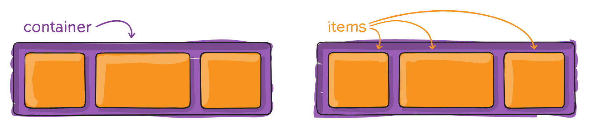
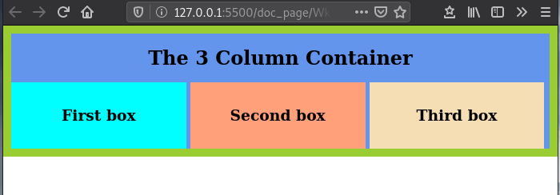

# 

*This lesson is based on the pages **[A Complete Guide to Flexbox](https://css-tricks.com/snippets/css/a-guide-to-flexbox/)** by CSS-Tricks and **[Flexbox](https://developer.mozilla.org/en-US/docs/Learn/CSS/CSS_layout/Flexbox)** by MDN Web Docs*


# Intro to Flexbox

**[Flexbox](https://developer.mozilla.org/en-US/docs/Web/CSS/CSS_Flexible_Box_Layout) is a one-dimensional layout method for laying out items in rows or columns.**

Items of a flex container adapt by growing or shriking it's size along one direction.


<p align="center"><a href="https://codebond.co/tutorial/css/complete-guide-to-flexbox"><em>Complete Guide to Flexbox</em></a></p>
<br>

The flexbox "framework" is achieved via the `display` property:

```css
.mycontainer {
  display: flex;
}
```


<br>

## Axis and Terminology


Every flexbox behaviour depends on the axis of orientation.

**By default, the main axis goes along the horizontal and the cross axis follows the vertical**


<br>

Flexbox uses specific terminology to define the **parent-child relationship**:

<br>




<br>

Once a flex container is defined, it enables the following properties:

| Flex-related Property                                        | Description                                                  |
| :----------------------------------------------------------- | ------------------------------------------------------------ |
| [flex-direction](https://www.w3schools.com/cssref/css3_pr_flex-direction.asp) | Specifies the direction of the flexible items inside a flex container |
| [justify-content](https://www.w3schools.com/cssref/css3_pr_justify-content.asp) | Horizontally aligns the flex items when the items do not use all available space on the main-axis |
| [align-items](https://www.w3schools.com/cssref/css3_pr_align-items.asp) | Vertically aligns the flex items when the items do not use all available space on the cross-axis |
| [flex-wrap](https://www.w3schools.com/cssref/css3_pr_flex-wrap.asp) | Specifies whether the flex items should wrap or not, if there is not enough room for them on one flex line |
| [align-content](https://www.w3schools.com/cssref/css3_pr_align-content.asp) | Modifies the behavior of the flex-wrap property. It is similar  to align-items, but instead of aligning flex items, it aligns flex lines |
| [flex-flow](https://www.w3schools.com/cssref/css3_pr_flex-flow.asp) | A shorthand property for flex-direction and flex-wrap        |
| [order](https://www.w3schools.com/cssref/css3_pr_order.asp)  | Specifies the order of a flexible item relative to the rest of the flex items inside the same container |
| [align-self](https://www.w3schools.com/cssref/css3_pr_align-self.asp) | Used on flex items. Overrides the container's align-items property |
| [flex](https://www.w3schools.com/cssref/css3_pr_flex.asp)    | A shorthand property for the flex-grow, flex-shrink, and the flex-basis     properties |


<br>

# Default behaviour

We will use the code below to explore Flexbox's default bahaviour:

<iframe height="500" style="width: 100%;" scrolling="no" title="wk6_1 - Default_behaviour" src="https://codepen.io/maujac/embed/QWbdbPp?height=265&theme-id=dark&default-tab=html,result" frameborder="no" allowtransparency="true" allowfullscreen="true">
  See the Pen <a href='https://codepen.io/maujac/pen/QWbdbPp'>wk6_1 - Default_behaviour</a> by Mauricio Buschinelli
  (<a href='https://codepen.io/maujac'>@maujac</a>) on <a href='https://codepen.io'>CodePen</a>.
</iframe>


<br>

<br>

Once `display: flex` is added to the `<section>` element (the flex container),  **notice the following**:

- The block-level document flow of the `<article>` elements (the flex items) changes;
  
   
  
- If space permits, the size of each flex item is only wide enogh to display the content in a single line;

   

 - Flex items stretches vertically to cover the height of the container;

   

 - Content is justified to the left;

   

 - If all items cannot fit without wrapping their content, space is distributed according to the ammount of content in each item.

   

 - If the items had a fixed width, flexbox will not stretch them. 


<br>

The power of Flexbox comes from it's ability to resize and adapt to the spacial context in a very intuitive way.


<br>

## Flexbox Properties


!>  For the remainder of this section we will refer to the page **[A Complete Guide to Flexbox ](https://css-tricks.com/snippets/css/a-guide-to-flexbox/)** by CSS-Tricks.

See each property in action by applying them to the CodePen from the previous section.

<br>


# Enabling flexibility with `flex`

By default flex items do not share space evently (see the "Default behaviour" section). Their content determines how much space is allocated to them.


The `flex` property on the flex item works as a weight that tells the flex container how to distribute extra space to each item. 

 

> By assignning a number to the `flex` property you determine how many parts of the available space will be assigned to that item.
>
> In other words, it is like assigning a fraction of the total space distribute to the flex items


<br>


<p align="center"><strong>Assigning flex fractions </strong><a href="https://internetingishard.com/html-and-css/flexbox/"><em>Interneting is Hard</em></a></p>
<br>

**Equal flex**

```CSS
#my-container {
  display: flex;
}

.my-item {
  flex: 1;
}
```


<br>

**Unequal flex**

```css
#my-container {
  display: flex;
}

.normal-item {
  flex: 1;
}

.large-item {
  flex: 2;
}
```


<br>

It is also possible to mix flex items with an assigned `flex` property and flex items with default behaviour.

<br>


<p align="center"><strong>Mixing flex parts </strong><a href="https://internetingishard.com/html-and-css/flexbox/"><em>Interneting is Hard</em></a></p>
<br>


## `flex`: combining  `-grow`, `-shrink` & `-basis`

The property `flex` is the shorthand notation for:

- `flex-grow`
- `flex-shrink`
- `flex-basis`

<br>

The 2nd and 3rd parameters (`flex-shrink` and `flex-basis`) are optional.

**Default is `0 1 auto`**, but if you set it with a single number value, it becomes `<number> 1 0`.

<br>

> **It is recommended that you use the `flex` shorthand property** rather than set the individual properties. The shorthand sets the other values intelligently.


<br>

## Obsolete after Flex

Certain CSS properties **become obsolete** with the use of Flexbox:

- The use of  [`vertical-align`](https://developer.mozilla.org/en-US/docs/Web/CSS/vertical-align) property for aligning  `inline-block` element.
- The use of floats for layouts.
- Using `position: abosolute` to center content inside a parent container.


# References & Diving Deeper

> Recommended **cheat-sheet for this course**:
>
> -  [A Complete Guide to Flexbox](https://css-tricks.com/snippets/css/a-guide-to-flexbox/) by CSS Tricks
>
>   
>
> For a **tutorial format** with step by step instructions (some reading required): 
>
> -  [Flexbox](https://internetingishard.com/html-and-css/flexbox/) by Interneting is Hard
>
>   or
>
> - [Flexbox](https://developer.mozilla.org/en-US/docs/Learn/CSS/CSS_layout/Flexbox) by MDN Web Docs


<br>


# Hands-on

## Execises

1. Complete the **[flexbox challenges in  Flexbox Froggy](https://flexboxfroggy.com/)**


<br>

2. Complete all **[four Flex Layout tasks in *Test your skills: Flexbox*](https://developer.mozilla.org/en-US/docs/Learn/CSS/CSS_layout/Flexbox_skills)**

   - Task #4 is particularly challenging and requires a good understanding of flex properties.


## Lab 1 - Recreating the 3 column page


Revisit the [Lab 3 of week 5 (the 3 column container)](https://mau-jac.github.io/2W6-UI/#/./wk5/wk5_1_lists_reset?id=hands-on) and use `Flexbox` to equally distribute the columns.

Notes:

- Flexbox will remove the inherited spacing (whitespace) between the columns (yay).
- The fact that the `<h2>` element is a sibling of the `<article>` elements makes this layout particularly challenging. Normally the `<h2>` element would be a sibling of the flex container. 

<br>




<br>

### Solution: Wk6 - Lab 1


<!-- See the **[interactive video for step-by-step solution](http://bit.ly/2Pyexn8).** -->

