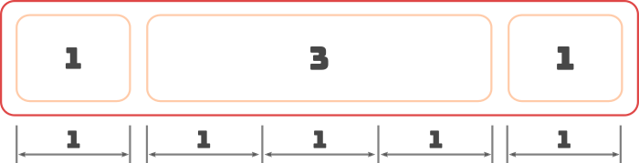
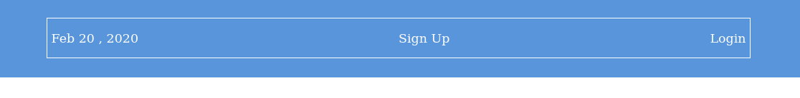
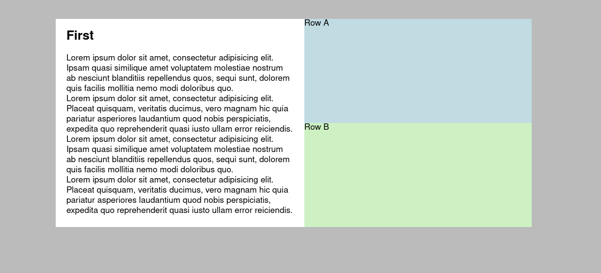

*This lesson was based on the page **[Flexbox](https://internetingishard.com/html-and-css/flexbox/#grouping-flex-items)** by Interneting is Hard and on the YoutTube video [**Flexbox Tutorial (CSS): Real Layout Examples**](https://www.youtube.com/watch?v=k32voqQhODc)  by LearnWebCode.*


# Page Layouts with Flexbox


Once you've learned to control the position of flex-items, creating non-linear page layouts becomes much easier and intuitive.


## Grouping Flex Items

Flexbox opens a new strategy for creating more interesting layouts: **grouping elements inside multiple flex containers**.


> Group sibling elements by **wrapping them into one or more flex containers** and position them using the flex properties.
>
> 
>
> When necessary, **enable vertical configurations** by changing the flex direction of a container from row to  column.


<br>


<p align="center"><strong>Grouping Flex Items </strong><a href="https://internetingishard.com/html-and-css/flexbox/"><em>Interneting is Hard</em></a></p>
<br>

### Example 1:  Three equal columns

Consider the starting code below:

<iframe height="500" style="width: 100%;" scrolling="no" title="Wk6_3_equal_cols" src="https://codepen.io/maujac/embed/wvaJYoO?height=265&theme-id=dark&default-tab=html,result" frameborder="no" allowtransparency="true" allowfullscreen="true">
  See the Pen <a href='https://codepen.io/maujac/pen/wvaJYoO'>Wk6_3_equal_cols</a> by Mauricio Buschinelli
  (<a href='https://codepen.io/maujac'>@maujac</a>) on <a href='https://codepen.io'>CodePen</a>.
</iframe>


<br>

**Notice the following:**

- The elements to be converted into columns are inside the **wrapper container** tagged with the class ***.call-outs-container***.
- The wrapper container is a sibling of the `<h2>` element.
- All elements are initially block level.


**Do the following:**

1. Convert ***.call-outs-container*** to a flex container by adding `display: flex;` to it's styling.
2. Notice how the size of the flex items depends on their content (the flex default behaviour).
3. Make each flex item grow to take equal parts of the flex container:
   - In the **styling for flex item** add `flex: 1;`
   - This will cause each item to take 1 equal part (from the total of 3 distributed parts)


### Example 2: Main and side columns

Consider the starting code below:

<iframe height="400" style="width: 100%;" scrolling="no" title="Wk6 - main_side_cols" src="https://codepen.io/maujac/embed/bGdqmeZ?height=265&theme-id=dark&default-tab=html,result" frameborder="no" allowtransparency="true" allowfullscreen="true">
  See the Pen <a href='https://codepen.io/maujac/pen/bGdqmeZ'>Wk6 - main_side_cols</a> by Mauricio Buschinelli
  (<a href='https://codepen.io/maujac'>@maujac</a>) on <a href='https://codepen.io'>CodePen</a>.
</iframe>

<br>

**Notice the following:**

- All elements are inside the `<section>` **wrapper container**.
- All elements are initially block level and include the class of *.col-margin*.


**Do the following:**

1. Convert `<section>`  to a flex container by adding `display: flex;` to it's styling.
2. Since the div tagged ***.main-column*** has much more content then the other elements it is assigned more space (the flex default behaviour).
   - This makes sense, however, we did not control the spacing. 
3. Make the main section 3 times as large as the sidebar :
   - In the **styling for *.main-column*** add `flex: 3;`
   - In the **styling for *.sidebar-one/two*** add `flex: 1;`
   - The `flex:` assignment is proportional to the total distribution of parts (a total of 5 parts in this case).

<br>




<br>

### Example 3: Navbar

In this example we will create a navigation bar where:

- The date leans to the left side of the navbar;
- "Sign Up" and "Login" lean on the right side of the navbar


<br>

Consider the starting code below.

*Note: the white borders are being used purely for debugging purposes. We will remove them at the end.*

<br>

<iframe height="400" style="width: 100%;" scrolling="no" title="Wk6 - navbar_flex" src="https://codepen.io/maujac/embed/zYGZbqR?height=265&theme-id=dark&default-tab=html,result" frameborder="no" allowtransparency="true" allowfullscreen="true">
  See the Pen <a href='https://codepen.io/maujac/pen/zYGZbqR'>Wk6 - navbar_flex</a> by Mauricio Buschinelli
  (<a href='https://codepen.io/maujac'>@maujac</a>) on <a href='https://codepen.io'>CodePen</a>.
</iframe>


<br>

**Notice the following:**

- The `<nav>` element with class ***.menu-container*** only has one child, the `<div>` of class ***.menu***.


**Do the following:**

1. Convert ***.menu-container*** into a flex container with `display: flex;`

   - Since `<nav>` only has one child, nothing will change.

2. Add the flex property `justify-content: center;`  to the ***.menu-container*** element in order to center its single flex item.

   > This has the same effect as adding a `margin: 0 auto` declaration to the `.menu` element.
   >
   > Notice how we did this by adding a property to the *parent* element (the flex container) instead of directly to the element we wanted to center (the flex item).

   

3. Convert ***.menu*** into a flex container by adding `display: flex;`

4. Distribute the children of *.menu* in order to maximise the space between them by adding `justify-content: space-between;`

   

   

   <br>

5. In the HTML wrap the "Sign Up" and the "Login" elements by creating a new `<div>` with the class of ***.links***

   - The flex behaviour `space-between`  should push the newly created container (the `<div>` with *.links*) away from it's sibling, the `<div>` with *.date*

   <br>

   ```html
   <div class='menu'>
     <div class='date'>Aug 14, 2016</div>
     <div class='links'>
       <div class='signup'>Sign Up</div>
       <div class='login'>Login</div>
     </div>
   </div>
   ```

   

   <br>

   

   <br>

6. Turn the ***.links*** element into a flex container so that its siblings sit side-by-side

   - At the same time, add a solid white border to *.links* in order to see how the layout is happening

7. Send the flex items of *.links* to the right side by using `justify-content: flex-end;`

8. Add a small spacing between "Sign Up" and "Login" by creating a new CSS rule:

   <br>

   ```css
   .login { margin-left: 20px; }
   ```


<br>


<br>

9. Remove all the white borders.

<br>

## Flex & Auto-Margins 

Auto-margins in flexbox can be used as an alternative to creating a wrapper `<div>` in order to align a group of items to the left/right of a container.

> Auto-margins in a flex item can used to **create as much space as possible (separation)** between elements inside a container.
>
> The **auto-margin is set on a sibbling element**, not on the flex container.


In the example above, the reparation between the date and "Sign Up" can be made with auto-margins:


1. Flatten the ***.menu*** by removing the additional `<div>` tagged as *.links*

2. Add a left auto-margin on the ***.signup*** element:

   ```css
   .signup {
     margin-left: auto;
   }
   ```

   

   <br>

   - Since the auto-margin is only on the left side, it will "eat up" all the extra space in a flex container.
   - You should achieve the same result as before.

<br>

## References & Diving Deeper

> Recommended reading:
>
> -   **[Flexbox](https://internetingishard.com/html-and-css/flexbox/#grouping-flex-items)** by Interneting is Hard
>    -  *Includes the same tutorial with detailed explanations*
>
> Recommended video:
>
> <iframe width="560" height="315" src="https://www.youtube.com/embed/k32voqQhODc" frameborder="0" allow="accelerometer; autoplay; encrypted-media; gyroscope; picture-in-picture" allowfullscreen></iframe>
>


<br>

## Hands-on

### Lab 2

Use the provided starting code, create the layout in the image below:

**Notes:**

- You should not change the provided HTML.


<iframe height="400" style="width: 100%;" scrolling="no" title="Wk6_2 - Lab2_start" src="https://codepen.io/maujac/embed/JjdWVzK?height=265&theme-id=dark&default-tab=html,result" frameborder="no" allowtransparency="true" allowfullscreen="true">
  See the Pen <a href='https://codepen.io/maujac/pen/JjdWVzK'>Wk6_2 - Lab2_start</a> by Mauricio Buschinelli
  (<a href='https://codepen.io/maujac'>@maujac</a>) on <a href='https://codepen.io'>CodePen</a>.
</iframe>


<br>

**Desired Layout:**





<br>

#### Solution for Lab 2

<!-- See the [**interactive video for step-by-step solution**](http://bit.ly/32K2bO7). -->

<br>


### Lab 3

Use the starting code provided and create the website layout illustrated in the wireframe below:

<iframe height="400" style="width: 100%;" scrolling="no" title="Wk6 - Lab 3" src="https://codepen.io/maujac/embed/qBdmOVL?height=265&theme-id=dark&default-tab=html,result" frameborder="no" allowtransparency="true" allowfullscreen="true">
  See the Pen <a href='https://codepen.io/maujac/pen/qBdmOVL'>Wk6 - Lab 3</a> by Mauricio Buschinelli
  (<a href='https://codepen.io/maujac'>@maujac</a>) on <a href='https://codepen.io'>CodePen</a>.
</iframe>


<br>

***Desired [Wireframe](https://webdesign.tutsplus.com/articles/a-beginners-guide-to-wireframing--webdesign-7399) Layout:***

