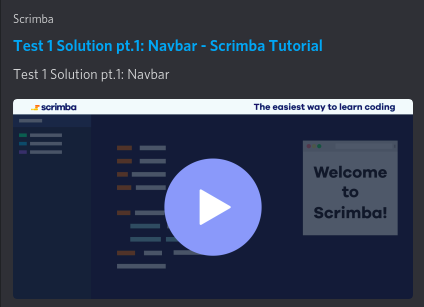

# Test 1 Solution

I've recorded the solution to Test over 3 Scrimba videos.

> These videos offer an interactive IDE, so at any moment you can stop the video and edit the code in the screen. Once you are done, hit play again and the video will resume.

 

**If you would like to see the final solution only, see the end of pt. 3.**

### [Navbar (pt.1)](https://scrimba.com/c/cE9Kbrf2) 

### [Hero section (pt.2)](https://scrimba.com/c/cJwpmySv)

### [Semantic HTML & Final solution (pt.3)](https://scrimba.com/c/cGmQ3zU7)