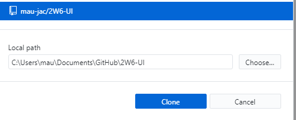

# Git & GitHub Primer

## Git vs GitHub

**Git** is a command-line application and a workflow for managing code through the practice of version control.

**GitHub** is a cloud service for uploading, seeing and hosting Git projects.

A code-base managed by with the Git program can be hosted just locally (a repository in your computer), or both locally and remotely (a repository in GitHub).

## Setting up Git in your computer

The remote repository (GitHub) and the local repository (your computer) need to stay synchronised.

There are basically two ways of doing that:

- Using **Git itself**, which is a command line application.
- Using a graphical applications such as **GitHub Desktop** or **GitKraken**.

**Graphical applications wrap-around and use Git**. They simply give you a more user-friendly way of running Git commands.

Regardless of your choice of application, you will need Git installed in your computer anyway. Some graphical applications will install Git in the background.

> There are many ways of setting up your Git environment.
>
> I suggest you following the steps below:

 

### Step 1: Install Git directly

1. Visit [the official Git website](https://git-scm.com/downloads) and download the installer.
2. Run the installer and accept all default options.

 

 

### Step 2: Create a GitHub Account

1. Go to https://github.com
   and create an account.

2. For your username, I encourage you to choose something professional. This account will showcase your work going forward in the program and can be used when applying for jobs.

   

### Step 3: Get a GitHub Student Developer Pack

GitHub gives students free access to amazing pro developer tools, **including GitKraKen** (see more below).

The verification involves a few steps but it is totally worth it.

1. Go to https://education.github.com/pack#offers and select "Get the Pack"

    

   

   

   

    

2. Follow the steps to get a "student" license.

3. You will need to have an **image of your Student ID**. You can scan or take a picture of it.

   

   

    

4. In the "what's the name of your school?" field, enter ***John Abbott College***.

5. In the "how do you plan to use GitHub?" field, enter I plan to use GitHub for personal and school
   projects.

6. Wait for further verification instructions from GitHub.

### Step 4: Create a Remote Repository

1. Create a new GitHub repository by clicking on the + icon in the top right of any GitHub page while logged in. Alternatively, go to https://github.com/new.

   

   

   

    

2. Enter the repository **name specified by the teacher or the requirements**.

3. Make sure the repository is **private**.

4. (Optional) Check Initialize this repository with a README if you would like to greet visitors with information about your repository.

5. Don't worry about the gitignore and the license fields.

6. Click Create repository. 

7. In the main navigation bar (Code, Issues, etc.) select Settings.

8. Click on Collaborators.

9. Enter the teacher's username into the box and click Add collaborator.

> Note: You can also create a GitHub repository using some graphical applications such as GitHub Desktop.

### Step 5: Choose a Graphical Application

Git is natively a command-line tool, however, a graphical application is recommended for beginners.

I recommend the following graphical tools:

- **GitHub Desktop** - is the easiest to setup. Integrates seamlessly with GitHub accounts.
- **GitKraken** - offers the most complete feature set. Requires a GitHub student account for private repositories (see step 3 above).
- **VS Code's Source Control module** - does not requires additional software but is not as visual as the previous two. The initial clone or download of the repository must be done by another method (normally via the command line).

The rest of this guide will focus on GitHub Desktop since it is the easiest for beginners.

> GitKraken Pro is available to students for free.
>
> You must get a GitHub Student Developer Pack (see step 3 above).

### Step 6: Install GitHub Desktop (or GitKraKen)

1. Visit [the official GitHub Desktop website](https://desktop.github.com/) and download the application.

 

 

2. Run the installer and **sign-in with your GitHub account** (same applies for GitKraKen).

### Step 7a: Clone Your Repository (via a GUI application)

1. Select ***Clone a repository***

2. Choose the repository to be cloned **and the location in your local computer** where it will be downloaded.

3. Clone it.

   

   

    

   > Once a repository is cloned into your computer it is now part of your files.
   >
   > You can create new files, folder and handle it like any other folder. 

   

### Step 7b: Clone Your Repository (via HTTPS)

1. Open the GitHub repository page to be cloned.

2. On the top-right of the page select ***Clone or Download***

3. Choose **Clone with HTTPS** (if not already selected)

4. Copy the URL

   

   

    

5. Open the application **Git Bash** (installed with Git in step 1) or the **console in VS Code**.

6. In the command line navigate to the directory where you will download the repository.

7. To clone use the command: `git clone <HTTPS url copied from GitHub>`

8. You now have a local copy of the remote repository.

## Video Guides

If you would like more detailed information I recommend that you watch the videos below.

**These three videos go over similar steps as the ones described in this page.**

### 1 - How Git works

<iframe width="560" height="315" src="https://www.youtube.com/embed/1CSpuhpVRD0" frameborder="0" allow="accelerometer; autoplay; encrypted-media; gyroscope; picture-in-picture" allowfullscreen></iframe>

### 2 - Getting Started With GitHub Desktop

<iframe width="560" height="315" src="https://www.youtube.com/embed/ci3W1T88mzw" frameborder="0" allow="accelerometer; autoplay; encrypted-media; gyroscope; picture-in-picture" allowfullscreen></iframe>

### 3 - Repositories: Git clone & GitHub Desktop

<iframe width="560" height="315" src="https://www.youtube.com/embed/FY6ceaqFDeY" frameborder="0" allow="accelerometer; autoplay; encrypted-media; gyroscope; picture-in-picture" allowfullscreen></iframe>