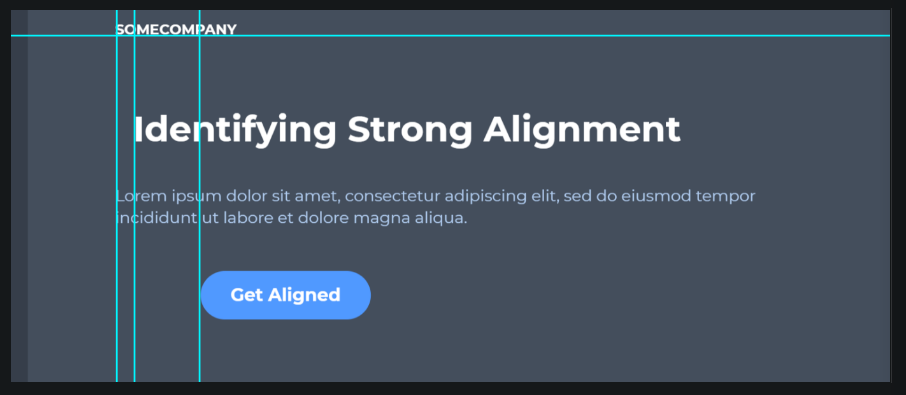
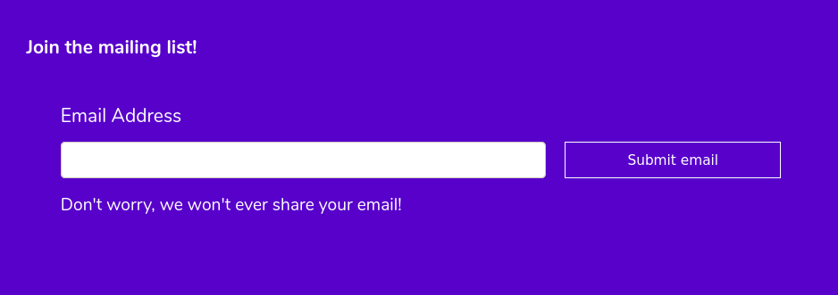
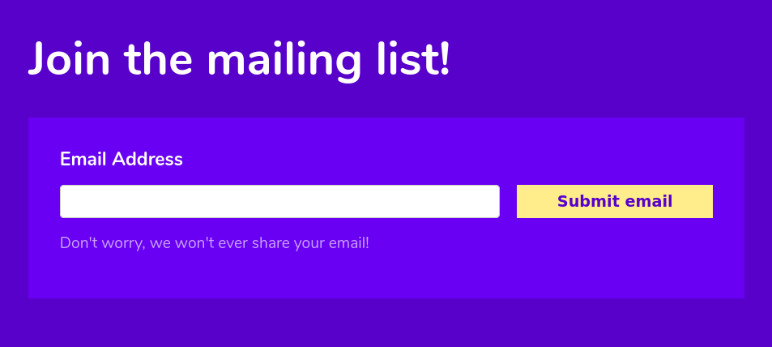

#

This lesson was based on the page **[Learn UI design fundamentals](https://www.freecodecamp.org/news/learn-ui-design-fundamentals-with-this-free-one-hour-course/)** by freeCodeCamp and  **[Alignment Principle Of Design](https://254-online.com/alignment-principle-design/)** by Gareth David.

# UI Design Fundamentals

This is not a Design course, however, in order to create attractice user interfaces we must understand some design principles.

**We will focus on 7 design fundamentals:**

- White space
- Color
- Contrast
- Scale
- Alignment
- Typography
- Visual Hierarchy

# White Space

White space is the empty space between the elements (also refereed to as negative space).

 

<iframe height="323" style="width: 100%;" scrolling="no" title="wk9 - Design - White space - ex1" src="https://codepen.io/maujac/embed/dyYyoBO?height=323&theme-id=light&default-tab=result" frameborder="no" allowtransparency="true" allowfullscreen="true">
  See the Pen <a href='https://codepen.io/maujac/pen/dyYyoBO'>wk9 - Design - White space - ex1</a> by Mauricio Buschinelli
  (<a href='https://codepen.io/maujac'>@maujac</a>) on <a href='https://codepen.io'>CodePen</a>.
</iframe>

 

In order to control the white space of your site elements focus on:

- `padding`
- `margin`
- `line-height`

 

>  **Tip 1:** Remove all default white space with `box-sizing: border-box` and increse it until it feels too much, then tone it down a few notches.
>
>  **Tip 2**: A recommeded `line-height` is between 1.4 and 2 (unitless).

 

The white space on top and the bottom should be consistent. Same thing for the left and right spacing.

# Alignment

Alignment is the process of ensuring that elements are positioned correctly in relation to one another.

 

**Each element in a UI defines a series of rows and columns.**

Align your elements based on these theoretical rows and columns.,

The imaghe below has 4 elements and only 2 of them align (see green vertical lines).

 

 

 

Using the CodePen below, align the elements without modifiying the existing CSS (only add to it).

 

<iframe height="415" style="width: 100%;" scrolling="no" title="wk9 - Design - Alignment - ex2" src="https://codepen.io/maujac/embed/rNONOxN?height=415&theme-id=light&default-tab=result" frameborder="no" allowtransparency="true" allowfullscreen="true">
  See the Pen <a href='https://codepen.io/maujac/pen/rNONOxN'>wk9 - Design - Alignment - ex2</a> by Mauricio Buschinelli
  (<a href='https://codepen.io/maujac'>@maujac</a>) on <a href='https://codepen.io'>CodePen</a>.
</iframe>

 

In design there are mostly two alignment principles:

- Edge alignment and
- Center alignment.

 

<a href="https://254-online.com/alignment-principle-design/"><em>Alignment Principle Of Design</em></a>

 

Good alignment is invisible i.e. this doesn’t have to be a literal line in your design.

**Avoid** the appearance of having made **arbitrary** decisions.

 

 

Not all elements need to align to the same line. In mixed alignement there should still be a grid system.

 

<a href="https://254-online.com/alignment-principle-design/"><em>Alignment Principle Of Design</em></a>

 

> Remember: **the browser itself is a container.**

 

# Contrast

Contrast is a 'strinkingly' different state between two or more things.

**Contrast allows us to notice things**

 

In the image below there is contrast between every element:

- Text and the button
- Button and the card
- Card and the background

 

 

**Contrast can be measured as ratios.**

Black and white offer the highest contrast level which is 21:1

 

>  In Canada and the USA every governmental website must **minimaly comply** to the AA level of the [Web Content Accessibility Guidelines (WCAG) version 2.0](https://www.w3.org/TR/WCAG20/).

 

There are three levels of conformance:

- [**AA (minimum)**](https://www.w3.org/WAI/GL/WCAG20/): The presentation of text has a **contrast ratio of at least 4.5:1**, except for large text which should have a contrast ratio of at least **3:1**.

- [**AAA (Enhanced)**](https://www.w3.org/WAI/GL/WCAG20/): Presentation of text has a **contrast ratio of at least 7:1**, except for large text which should have a contrast ratio of at least **4.5:1**.

 

## Contrast Checking Tools

It is very easy to know if you have the right color contrasts:

- [WebAIM's Contrast Checker](https://webaim.org/resources/contrastchecker/)
- Browser Plugins - WCAG contrast checker ([Chrome](https://chrome.google.com/webstore/detail/wcag-color-contrast-check/plnahcmalebffmaghcpcmpaciebdhgdf)) ([Firefox](https://addons.mozilla.org/en-US/firefox/addon/wcag-contrast-checker/))

 

In the example below, **both smaller texts fail** the contrast check.

- Hyperlink text contrast is 2.45:1
- Paragraph text contrast is 2.37:1

 

<iframe height="401" style="width: 100%;" scrolling="no" title="wk9 - Design - ColorContrast - ex3" src="https://codepen.io/maujac/embed/JjYjYxy?height=401&theme-id=light&default-tab=result" frameborder="no" allowtransparency="true" allowfullscreen="true">
  See the Pen <a href='https://codepen.io/maujac/pen/JjYjYxy'>wk9 - Design - ColorContrast - ex3</a> by Mauricio Buschinelli
  (<a href='https://codepen.io/maujac'>@maujac</a>) on <a href='https://codepen.io'>CodePen</a>.
</iframe>

 

# Scale

The size of one element compared to another is a form of contrast and must be considered.

 

Ask yourself:

- Are there "empty " areas that could be levearaged if we increased the size of some elements ?
- Where do you want the "eyes" of the user to go first? Make those elements larger.
- Are there any elements that are grossely out of scale compared to most elements ?

 

<iframe height="797" style="width: 100%;" scrolling="no" title="wk9 - Design - Scale - ex4" src="https://codepen.io/maujac/embed/QWjWgQP?height=797&theme-id=light&default-tab=result" frameborder="no" allowtransparency="true" allowfullscreen="true">
  See the Pen <a href='https://codepen.io/maujac/pen/QWjWgQP'>wk9 - Design - Scale - ex4</a> by Mauricio Buschinelli
  (<a href='https://codepen.io/maujac'>@maujac</a>) on <a href='https://codepen.io'>CodePen</a>.
</iframe>

 

To adjust the scale of the design above we can:

- Lower the `font-size` of the h1 element;
- Let the cards take ht empty horizontal space;
- "highlight" the color codes since they are a main element in the page.

 

# Color

Color choices has a strong psychological impact on the "feel" of your website.

The transmitted impressions can change depending on culture so always keep your target audience in mind.

 

Bellow are some commonly used examples:

<a href="https://www.usertesting.com/blog/color-ux-conversion-rates"><em>How color impacts conversion rates and UX</em></a>

 

**Limit the number of colors in your design to a color palette (a set of a few compatible colors)**

 

Compare the number of colors between both designs below:

 

## Color Theory

We will not go into Color Theory, however, it is an important field of design.

Some topics include:

- Warm and cool colors

- Monochromatic colors

- Analogous Colors

- Complimentary Colors

  

> To learn more about color theory visit  [**Colour As A Visual Element In Graphic Design**](https://254-online.com/colour-as-a-visual-element-in-graphic-design/)

 

## Color Palettes

It can be hard to choose a good color palette, however, there are many color palette generators available:

- [**colorpalettes.net**](https://colorpalettes.net/)	
  - Suggest a color palette and show the image that inspired it
- [**coolors.co**](https://coolors.co/browser/latest/1)
  - Have a "Generate" feature to randomly generate compatible colors.
  - Have a "Explore" feature to see palettes uploaded by other users.

> **Tip:** always have a color palette as you design your website, even if the palette changes.

 

The example code below has a bad color selection. We will improve by working with a color palette.

 

<iframe height="450" style="width: 100%;" scrolling="no" title="wk9 - Design - Color - ex5" src="https://codepen.io/maujac/embed/MWaWvpJ?height=450&theme-id=light&default-tab=result" frameborder="no" allowtransparency="true" allowfullscreen="true">
  See the Pen <a href='https://codepen.io/maujac/pen/MWaWvpJ'>wk9 - Design - Color - ex5</a> by Mauricio Buschinelli
  (<a href='https://codepen.io/maujac'>@maujac</a>) on <a href='https://codepen.io'>CodePen</a>.
</iframe>

 

# Typography

**Typography** is the art and technique of [arranging font types](https://en.wikipedia.org/wiki/Typesetting) to make written language **legible, and appealing**.

 

All of the design fundamentals mentioned here are related to one another. Typography is closely related to:

- Scale (font size)
- Alignment
- Color & contrast
- Visual Hierarchy
- White space
- Limit line length

> As a rule of thumb, try to use **no more than 2 to 3 different font families**
>
> To learn more see [**10 Tips On Typography in Web Design**](https://uxplanet.org/10-tips-on-typography-in-web-design-13a378f4aa0d)

 

# Visual Hierarchy

Every element on a user interface has a level of important. Visual hierarchy is how you establish the priority between the elements.

Visual hierarchy combines all the other design fundamentals seen above, however, it is **mostly influenced by color and scale**.

 

 

Compare the hierarchy between the two examples below:

 

 

# Observe, think, mimic

As a beginner you don't have to reinvent the wheel. You can learn from the best.

The next time you visit a website or use an app, ***observe*** at it and ***think*** about why it looks and behaves the way it does.

 

**Ask yourself the following:**

- Why are elements placed where they are?
- Is there a color scheme to things?
- Can you infer functionality from the looks of elements?
- Do you have to perform actions in a certain order? If so, why?
- Do you like it? If so, why?

 

## Catalog it for later visit

Make sure to save or bookmark sites that you find interesting.

This will help you understand what you like and help you develop your own style.

Some popular design agglomerators:

- [**dribble.com**](https://dribbble.com/)
- [**awwwards.com**](https://www.awwwards.com/)

 

# Hands-on

## Lab 1

Strating with the provided code, improve the visual design by using the selectors provided in the CSS.

Focus on the following CSS properties:

- width
- background-color
- padding
- margin
- font-size
- letter-spacing
- color
- font-family 

**Notes:**

- **You can only add to the empt CSS selectors.** You should not change the existing HTML or CSS.

<iframe height="516" style="width: 100%;" scrolling="no" title="wk9 - Design - Execise1" src="https://codepen.io/maujac/embed/JjYjyem?height=516&theme-id=light&default-tab=result" frameborder="no" allowtransparency="true" allowfullscreen="true">
  See the Pen <a href='https://codepen.io/maujac/pen/JjYjyem'>wk9 - Design - Execise1</a> by Mauricio Buschinelli
  (<a href='https://codepen.io/maujac'>@maujac</a>) on <a href='https://codepen.io'>CodePen</a>.
</iframe>

 