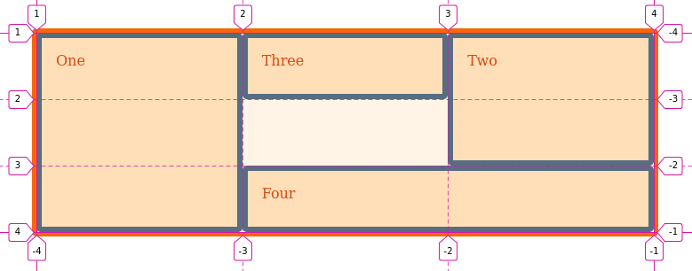
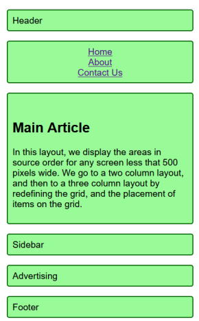
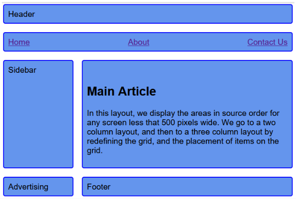
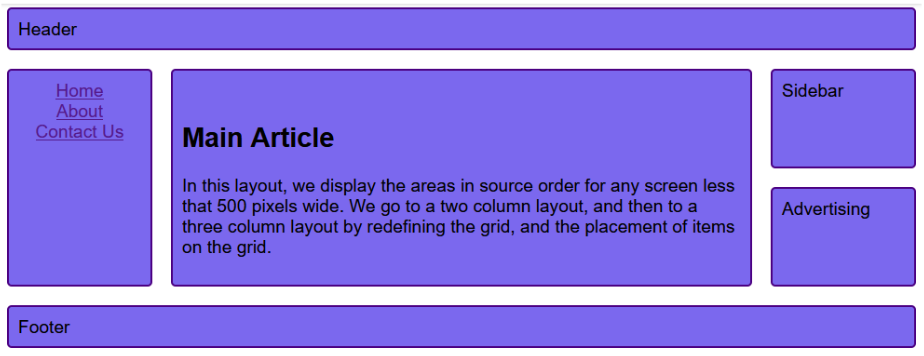

This lesson was based on the page **[Basic Concepts of grid layout](https://developer.mozilla.org/en-US/docs/Web/CSS/CSS_Grid_Layout/Basic_Concepts_of_Grid_Layout)** by MDN web docs, **[A Complete Guide to Grid](https://css-tricks.com/snippets/css/complete-guide-grid/)** by CSS Tricks and [**CSS Grid Layout Module**](https://www.w3schools.com/css/css_grid.asp) by W3Schools.


# Website Layouts with Grid

We will continue to explore CSS Grid and how it can facilitate the create of website layouts.


## Nesting Grids

A grid item can also become a grid container

```html
<div class="wrapper">
    <div class="box1">
        <div class="nested">a</div>
        <div class="nested">b</div>
        <div class="nested">c</div>
    </div>
    <div class="box2">Two</div>
    <div class="box3">Three</div>
    <div class="box4">Four</div>
</div>
```


```css
.wrapper {
  display: grid;
  grid-template-columns: repeat(3, 1fr);
}

.box1 {
  grid-column: 1/4;
  grid-row: 1/3;
  
  display: grid;
  grid-template-columns: repeat(4, 1fr);
}

.nested:nth-child(2){
  grid-column: 2/4;
}
```


<iframe height="287" style="width: 100%;" scrolling="no" title="wk9-layout_grid-ex10" src="https://codepen.io/maujac/embed/mdJNOpq?height=287&theme-id=light&default-tab=result" frameborder="no" allowtransparency="true" allowfullscreen="true">
  See the Pen <a href='https://codepen.io/maujac/pen/mdJNOpq'>wk9-layout_grid-ex10</a> by Mauricio Buschinelli
  (<a href='https://codepen.io/maujac'>@maujac</a>) on <a href='https://codepen.io'>CodePen</a>.
</iframe>


<br>

## Overlapping Grid Items

Grid items can overlap inside their grid container without any problems.

<br>

In the example below **.box2 overlaps on top of .box1** and **.box3 overlaps on top of .box2**.

*Transparency was added to the grid items.*

<br>

```html
<div class="wrapper">
    <div class="box box1">One</div>
    <div class="box box2">Two</div>
    <div class="box box3">Three</div>
    <div class="box box4">Four</div>
</div>
```


```css
.wrapper {
  display: grid;
  grid-template-columns: repeat(3, 1fr);
  grid-auto-rows: 75px;
}

.box1 {
  grid-column: 1 / 4;
  grid-row: 1 / 3;
}

.box2 {
  grid-column: 1 / 3;
  grid-row: 2 / 4;
}

.box3 {
  grid-column: 2 / 3;
  grid-row: 3 / 4;
}
```


<iframe height="336" style="width: 100%;" scrolling="no" title="wk9-z-overlap-ex11" src="https://codepen.io/maujac/embed/MWwNbNw?height=336&theme-id=light&default-tab=result" frameborder="no" allowtransparency="true" allowfullscreen="true">
  See the Pen <a href='https://codepen.io/maujac/pen/MWwNbNw'>wk9-z-overlap-ex11</a> by Mauricio Buschinelli
  (<a href='https://codepen.io/maujac'>@maujac</a>) on <a href='https://codepen.io'>CodePen</a>.
</iframe>


<br>

## Layering Grid Items

Grid items can be layered/stacked by properly positioning them and assigning `z-index` when necessary. 

> The higher the `z-index` value the higher the priority order of the element.
>
> The default value of `z-index` is 0.

<br>

Considering the previous example, we will place .box2 on top of .box1 **and** .box3 by setting it's `z-index` to 1.


```css
.box2 {
  grid-column: 1 / 3;
  grid-row: 2 / 4;
  z-index: 1;
}
```


<iframe height="337" style="width: 100%;" scrolling="no" title="wk9-z-index-ex12" src="https://codepen.io/maujac/embed/PoqMpzP?height=337&theme-id=light&default-tab=result" frameborder="no" allowtransparency="true" allowfullscreen="true">
  See the Pen <a href='https://codepen.io/maujac/pen/PoqMpzP'>wk9-z-index-ex12</a> by Mauricio Buschinelli
  (<a href='https://codepen.io/maujac'>@maujac</a>) on <a href='https://codepen.io'>CodePen</a>.
</iframe>


<br>

## Grid area Property

It is possible to shorten the `grid-row` and `grid-column` notation even further by using `grid-area`

The order of value declaration of `grid-area` is as follows:

1. grid-row-start number
2. grid-column-start number
3. grid-row-end number
4. grid-column-end number

<br>

**Syntax**

```css
grid-area: <row-start> / <column-star> / <row-end> / <column-end>
```


> Think of the order of declaration as the definition of two points, each defined by a set of row and line numbers in a coordinate system.
>
> - First value is the top-left point
> - Second value is the bottom-right point.


<br>

Example of `grid-area`:

<br>

```html
<div class="wrapper">
   <div class="box1">One</div>
   <div class="box2">Two</div>
   <div class="box3">Three</div>
   <div class="box4">Four</div>
</div>
```


```css
.wrapper {
  display: grid;
  grid-template-columns: repeat(3, 1fr);
  grid-template-rows: repeat(3, 75px);
}

.box1 {
   grid-area: 1 / 1 / 4 / 2;
}
.box2 {
   grid-area: 1 / 3 / 3 / 4;
}
.box3 {
   grid-area: 1 / 2 / 2 / 3;
}
.box4 {
   grid-area: 3 / 2 / 4 / 4;
}
```


<iframe height="389" style="width: 100%;" scrolling="no" title="wk9-grid-area-ex13" src="https://codepen.io/maujac/embed/XWbvRVW?height=389&theme-id=light&default-tab=result" frameborder="no" allowtransparency="true" allowfullscreen="true">
  See the Pen <a href='https://codepen.io/maujac/pen/XWbvRVW'>wk9-grid-area-ex13</a> by Mauricio Buschinelli
  (<a href='https://codepen.io/maujac'>@maujac</a>) on <a href='https://codepen.io'>CodePen</a>.
</iframe>


<br>

<br>

Below the line numbers are added to help visualize the placement:

<br>



<br>


### Naming and Positioning by Grid Areas

In the example above we defining an area by specifying the lines that enclose that area:


```css
.box1 {
   grid-area: 1 / 1 / 4 / 2;
}
```


<br>

It is also possible to define an area by giving it a name via  [`grid-area`](https://developer.mozilla.org/en-US/docs/Web/CSS/grid-area)  and then specify the location of that area with the [`grid-template-areas`](https://developer.mozilla.org/en-US/docs/Web/CSS/grid-template-areas) property.

<br>

Consider the layout below with the following sections:

- header
- footer
- sidebar
- main content

<br>

```html
<div class="wrapper">
    <header>Header</header>
    <footer>Footer</footer>
    <main>Main</main>
    <aside class="sidebar">Sidebar</aside>
</div>
```


<br>

### Assigning names with `grid-area` 

You can assign any name to a HTML element with the `grid-area`  property.

<br>

```css
header {
    grid-area: hd;
}
footer {
    grid-area: ft;
}
main {
    grid-area: main;
}
.sidebar {
    grid-area: sd;
}
```


<br>

Once the naming convention has been assigned, create the layout using the item names instead of line numbers. 

<br>


### Templates with `grid-template-areas`

The `grid-template-areas` property defines a grid template by referencing the names of the grid areas.

<br>

- Repeating the name of a grid area causes the content to span those cells.
- The area names should be surrounded in single or double quotes.
- Each name must be separated by a whitespace.
- A period signifies an empty cell. 

<br>

```css
.wrapper {
	display: grid;
	grid-template-columns: repeat(4, 1fr);
	grid-template-rows: repeat(3, 75px);
    
    grid-template-areas: 
      "hd  hd  hd   hd"
      "sd  .  main main"
      "sd  ft  ft   ft";
}
```


<iframe height="386" style="width: 100%;" scrolling="no" title="wk9-grid-area_names-ex14" src="https://codepen.io/maujac/embed/vYOomae?height=386&theme-id=light&default-tab=result" frameborder="no" allowtransparency="true" allowfullscreen="true">
  See the Pen <a href='https://codepen.io/maujac/pen/vYOomae'>wk9-grid-area_names-ex14</a> by Mauricio Buschinelli
  (<a href='https://codepen.io/maujac'>@maujac</a>) on <a href='https://codepen.io'>CodePen</a>.
</iframe>


<br>

## Redefining the grid with media queries


If you define the grid layout with `grid-template-areas`  (technique above), it is very easy to modify the layout using media queries.

<br>

Since the names for the areas have already been defined with `grid-area` we can just reuse them:


```css
@media (min-width: 900px) {
    .wrapper {
      grid-template-rows: 1fr 4fr 1fr;      
      grid-template-columns: repeat(5, 1fr);
      grid-template-areas: 
        " hd   hd   hd   hd  hd"
        "main main main main sd"
        " ft   ft   ft   ft  ft";
    }
}
```


<iframe height="353" style="width: 100%;" scrolling="no" title="wk9-grid- mediaQ - Area - ex15" src="https://codepen.io/maujac/embed/ExjqXRb?height=353&theme-id=light&default-tab=result" frameborder="no" allowtransparency="true" allowfullscreen="true">
  See the Pen <a href='https://codepen.io/maujac/pen/ExjqXRb'>wk9-grid- mediaQ - Area - ex15</a> by Mauricio Buschinelli
  (<a href='https://codepen.io/maujac'>@maujac</a>) on <a href='https://codepen.io'>CodePen</a>.
</iframe>

<br>


## Using Grid vs Flexbox

When to use Grid rather than Flexbox? Ask yourself the following questions:


### 1 direction vs 2 directions


If you **only** need to control the layout by **row *or* column** – use a flexbox

If you need to control the layout by **both row *and* column** – use a grid


### Content out or layout in ?


Flexbox works from the content out, meaning you start with a set of items and then you space them out evenly inside a flexbox.

- The size of the content decides how much individual space each item  takes up **on that line.**


Grid works from the layout in. You start by creating a layout and then you place items inside it.

- The layout of the grid determines the size of the elements.

  <br>


>  If you are using flexbox and find yourself disabling some of the  flexibility, you probably need to use CSS Grid Layout.


An example would be setting a percentage width on a flex item to make it line up with other items in a row above.


> Flexbox and Grid are perfectly compatible and most powerful when used together


<br>

## References & Diving Deeper

Recommended readings:


 -   **[Grid by Example](https://gridbyexample.com/examples/)** by Rachel Andrew.
     -  *Includes several layout examples*
-   [**Realizing common layouts using CSS Grid Layout**](https://developer.mozilla.org/en-US/docs/Web/CSS/CSS_Grid_Layout/Realizing_common_layouts_using_CSS_Grid_Layout) by MDN web docs.
-    **[A Complete Guide to Grid](https://css-tricks.com/snippets/css/complete-guide-grid/)** by CSS Tricks


 Recommended video:

<iframe width="560" height="315" src="https://www.youtube.com/embed/br-0i3U1VCA" frameborder="0" allow="accelerometer; autoplay; encrypted-media; gyroscope; picture-in-picture" allowfullscreen></iframe>


<br>

## Hands-on

### Exercises

1. Complete  [**any missing levels from Grid Garden**](https://cssgridgarden.com/).

   

### Lab 1

Starting with the provided code, create the layout below using **Flexbox and Grid together**.


**Notes:**

- You should not change the provided HTML.


<br>

<iframe height="516" style="width: 100%;" scrolling="no" title="wk9 - Grid -  Lab1" src="https://codepen.io/maujac/embed/rNVXgdX?height=516&theme-id=light&default-tab=html" frameborder="no" allowtransparency="true" allowfullscreen="true">
  See the Pen <a href='https://codepen.io/maujac/pen/rNVXgdX'>wk9 - Grid -  Lab1</a> by Mauricio Buschinelli
  (<a href='https://codepen.io/maujac'>@maujac</a>) on <a href='https://codepen.io'>CodePen</a>.
</iframe>


<br>

<!-- **Lab 1 solution** available [here](https://codepen.io/maujac/pen/VwvvawB) -->

<br>


### Lab 2

Create a responsive website that follows the layouts below. Follow these requirements:

- Design mobile-first.
- Only define your grid-area names and properties once.
- You should have 3 different instances of the grid-template-areas property in your CSS, one for each layout.
- Media Query break points:
  - Mobile: below 500px;
  - Table: between 500px and 900px;
  - Desktop: above 900px;
- For your convenience, a CodePen is provided to get started: 

<br>











<br>

<iframe height="265" style="width: 100%;" scrolling="no" title="wk9 - Grid -  Lab2_start" src="https://codepen.io/maujac/embed/MWJjeKo?height=265&theme-id=dark&default-tab=css,result" frameborder="no" loading="lazy" allowtransparency="true" allowfullscreen="true">
  See the Pen <a href='https://codepen.io/maujac/pen/MWJjeKo'>wk9 - Grid -  Lab2_start</a> by Mauricio Buschinelli
  (<a href='https://codepen.io/maujac'>@maujac</a>) on <a href='https://codepen.io'>CodePen</a>.
</iframe>

<br>

<!-- **Lab 2 solution** available [here](https://codepen.io/maujac/pen/bGVVpdb) -->


<br>